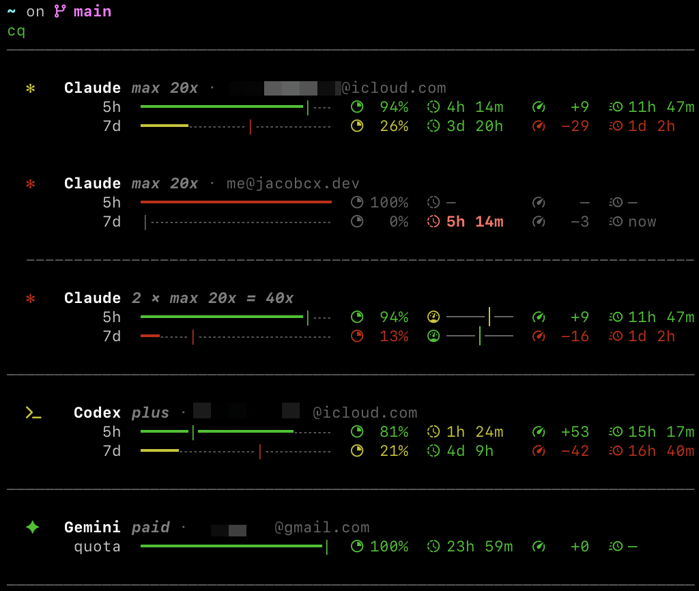

# cq

A CLI tool to check your AI provider quota usage at a glance. Supports **Claude**, **Codex**, and **Gemini**.

## Install

```bash
brew install jacobcxdev/tap/cq
```

Or with Go:

```bash
go install github.com/jacobcxdev/cq/cmd/cq@latest
```

## Usage

```bash
cq                       # Check all providers
cq check claude          # Check specific providers
cq --json                # JSON output
cq --refresh             # Bypass cache
```

### Account Management (Claude & Codex)

```bash
cq claude login          # Add account via OAuth
cq claude accounts       # List accounts
cq claude switch EMAIL   # Switch active account
cq codex accounts        # List accounts
cq codex switch EMAIL    # Switch active account
```

> **Note:** After switching accounts, MCP servers that use the provider's credentials (e.g. Codex MCP) may need to be reconnected to pick up the new active account.

## What It Shows

For each provider, cq displays remaining quota as a percentage bar, pace indicator, and burndown estimate for each rate-limit window. Requires a [Nerd Font](https://www.nerdfonts.com/) for icons to render correctly. Recommended: [`jacobcxdev/tap/liga-sf-mono-nerd-font`](https://github.com/jacobcxdev/homebrew-tap).



## Configuration

| Variable | Default | Description |
|----------|---------|-------------|
| `CQ_TTL` | `30s` | Cache duration (e.g., `1m`, `5m`) |

## Licence

MIT
