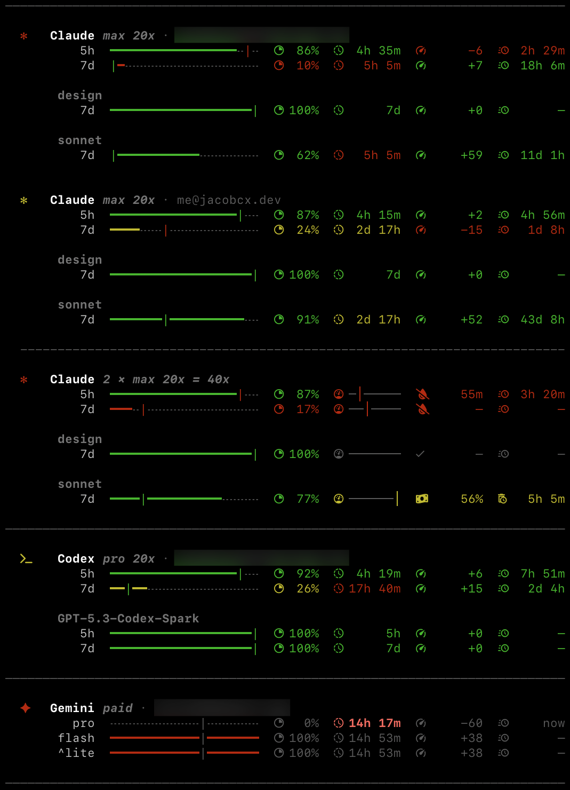

# cq

`cq` is a quota dashboard, account manager, model-registry publisher, and local Claude/Codex API router. It checks **Claude**, **Codex**, and **Gemini** quota in parallel, presents per-account and aggregate burn information, and can keep local AI clients on healthy accounts without exposing provider credentials.



## Install

Complete installers place an official release binary, install and start the
current-user proxy, and schedule periodic credential refresh. No manual
post-install command is required.

### macOS — Homebrew Cask

```bash
brew install --cask jacobcxdev/tap/cq
```

Existing formula installations must migrate once so the legacy Homebrew service
cannot conflict with Cask-owned services:

```bash
brew services stop cq
brew uninstall --formula cq
brew install --cask jacobcxdev/tap/cq
```

### Windows — WinGet

```powershell
winget install jacobcxdev.cq
```

WinGet installs CQ, its uninstaller, PATH and Add/Remove Programs metadata, and
both scheduled tasks for the current Windows user without administrator access.

### macOS, Windows, and Linux — Go installer runner

```bash
go run github.com/jacobcxdev/cq/cmd/cq-install@latest
```

The runner resolves its tagged release, downloads and verifies the matching
official CQ asset, then installs the same current-user services as each native
package. Linux requires a functional systemd user manager. Running services
after logout can also require systemd user lingering configured by the host.

Run the same install command to upgrade or repair an installation. Native
package-manager upgrades are also supported:

```bash
brew upgrade --cask cq
winget upgrade jacobcxdev.cq
```

Uninstall through the method that owns the installation:

```bash
brew uninstall --cask cq
winget uninstall jacobcxdev.cq
go run github.com/jacobcxdev/cq/cmd/cq-install@latest uninstall
```

Uninstall removes package-owned executables and services. User configuration,
credentials, cache, history, and logs remain.

## Development and portable binaries

Plain `go install` builds CQ from source for development:

```bash
go install github.com/jacobcxdev/cq/cmd/cq@latest
```

This binary lacks official release provenance and release-time Gemini refresh
material. It does not install or manage services. Direct release archives
contain official binaries, but extraction also does not install or manage
services. Use a complete installer when proxy and refresh lifecycle are wanted.

`headroom-ai` remains a separate, optional integration. CQ installers do not
install Python or optional integrations.

## Quick start

```bash
cq                                # Check Claude, Codex, and Gemini
cq check claude codex             # Check selected providers
cq check gemini                   # Check Gemini through Antigravity HTTP APIs
cq --json                         # Machine-readable report
cq --refresh                      # Bypass quota cache
cq --version
```

`check` accepts `claude`, `codex`, and `gemini`. Provider fetches run concurrently. Multi-account work also runs concurrently within each provider.

Use context-sensitive help for exact flags and safety confirmations:

```bash
cq --help
cq check --help
cq claude --help
cq codex --help
cq gemini --help
cq proxy --help
cq models --help
cq operation --help
```

## Capability map

| Area | Capabilities |
|------|--------------|
| Quota | Parallel Claude, Codex, and Gemini checks; provider selection; cache bypass; stale-account backfill; TTY and JSON output. |
| Analysis | Remaining quota, reset times, pace, smoothed burn rate, projected burndown, correction-deadline gauge, multi-account aggregate, provider availability. |
| Accounts | Claude and Codex OAuth login, listing, activation, switching, removal, and token refresh; read-only Gemini account inspection. |
| Background work | One-shot OAuth refresh and per-user periodic refresh on macOS, Windows, and Linux. |
| Proxy | Loopback Claude/Codex routing, Anthropic Messages compatibility, native Codex Responses HTTP/WebSocket routing, model discovery, local authentication, health/status inspection. |
| Routing controls | Claude/Codex pins, Codex default, account allowlist, quota/fairness selection, durable continuity, quota-window priming, capability pools, session bindings, rescue mode. |
| Codex assurance | Installed HTTP/WebSocket validation, routing canary, candidate runtime lifecycle, client-bearer barrier, release receipts, durable operation recovery, legacy endpoint transition. |
| Efficiency feedback | Privacy-safe Codex request-shape telemetry, turn receipts, observational no-affinity comparison, Codex Stop-hook output. |
| Model registry | Anthropic/Codex source merge, local listing, refresh, overlays, Codex cache publication, Claude Code capability and picker publication. |
| Diagnostics | Strict proxy snapshot, routing metadata JSONL, opt-in raw payload JSONL, health and runtime evidence, safe error classification. |

## Quota checks and output

### Providers

- **Claude** discovers stored accounts, fetches profile and usage data in parallel, refreshes eligible tokens, and reports each account.
- **Codex** discovers system, CQ-managed, and declared read-only external accounts. Ordinary checks do not activate, remove, refresh, or rewrite system credentials. Eligible CQ-owned credentials refresh only through CQ's coordinator.
- **Gemini** reads Antigravity Keychain credential and cached project ID concurrently, calls Antigravity OAuth and quota HTTP APIs directly, and never invokes `agy`. Credential/project stores remain read-only; refreshed tokens live only in process memory.

### Cache and history

Successful quota rows are cached by provider. Default TTL is 30 seconds; `--refresh` bypasses it. If one account has a transient fetch failure and a matching usable cached row exists, cq shows stale quota with original error context instead of hiding that account. Auth errors are never written as fresh cache data.

cq also keeps per-account/window EWMA burn history for trend display and a secondary imminent-block gauge override. Pace, burndown, and the main gauge derive from the current quota window and remain available without history. Cache and history failures degrade to uncached/cold-start behaviour.

### TTY report

For each provider/account, cq can show:

- plan/account identity and active credential marker;
- remaining percentage and reset time for each quota window;
- usage pace and smoothed burn rate;
- projected burndown;
- aggregate coverage across two or more usable accounts;
- correction-deadline gauge: overburn deadline on left, on-pace centre, projected waste on right;
- Codex proxy-eligible subset when discovery and routing eligibility differ;
- cached/stale and error context.

TTY icons require a [Nerd Font](https://www.nerdfonts.com/). Recommended: [`jacobcxdev/tap/liga-sf-mono-nerd-font`](https://github.com/jacobcxdev/homebrew-tap).

### JSON report

```bash
cq --json
cq --json check codex
cq codex accounts --json
cq gemini accounts --json
```

JSON includes provider results, aggregates, cache age, error codes, proxy eligibility, and an `availability` object for automated consumers:

- `available`: normal work is safe.
- `limited`: quota is low; conserve it for small, necessary, or approved work.
- `exhausted`: new work should not route there without explicit override.

Account-level `active` means credential default/current account. It is not a proxy routing decision; pins, bindings, eligibility, continuity, and failover can select another account.

## Accounts and authentication

### Claude

```bash
cq claude login --activate
cq claude accounts
cq claude switch EMAIL
cq claude remove EMAIL
```

Claude login uses browser OAuth. Stored account credentials support multi-account checks and proxy routing.

### Codex

```bash
cq codex login --activate
cq codex accounts
cq codex switch EMAIL
cq codex remove EMAIL
cq codex resets list
cq codex resets recommend
cq codex resets use EMAIL
cq codex resets use EMAIL --credit CREDIT_ID --yes
```

CQ-owned Codex accounts live under `~/.codex/accounts/` with registry metadata. System `~/.codex/auth.json` remains distinct. Automatic quota/routing reads never switch the system account.

`cq codex resets recommend` plans across every account shown by `cq codex accounts`. It fetches fresh usage and banked-reset inventories, reports a non-actionable incomplete schedule when any portfolio input is missing, and never consumes a credit. Banked resets restore shared-window percentages without changing natural 5-hour or 7-day reset dates.

`cq codex resets use EMAIL` previews selected credit, current shared usage, and current recommendation, then asks for confirmation with default No. Omit `--credit` to resume a pending attempt or select eligible credit with next expiry. Supply `--yes` only when explicit non-interactive consumption is intended.

### Gemini

```bash
cq gemini accounts
cq gemini accounts --json
```

Gemini authentication and project selection remain owned by Antigravity. cq reads Keychain service `gemini`, account `antigravity`, plus Antigravity's project cache. It does not provide Gemini login, switch, or removal commands.

### Token refresh

```bash
cq refresh
cq agent install
cq agent uninstall
```

`cq refresh` refreshes eligible Claude and Codex OAuth credentials before expiry. Complete installers schedule this work using the platform user service manager. `cq agent install` remains a focused macOS maintenance command. Expired Claude accounts can still require interactive login.

Ordinary quota and account commands do not change background service registration. Complete installers use `cq service install`; focused `cq agent` commands remain available for maintenance.

After an explicit account switch, already-running clients or MCP servers may need reconnection to reload credential state.

## Local proxy

`cq proxy` binds to loopback, routes Claude and Codex traffic, and publishes local model metadata. It supports Anthropic Messages clients plus native Codex Responses HTTP and WebSocket traffic, including compact, search, image, and realtime/live routes used by supported clients. The retired `/app-server` compatibility endpoint returns `410 Gone` with guidance to run Codex app-server locally and route its outbound Responses traffic through cq.

### Service lifecycle and status

Complete installers own service installation and removal. Use `cq service` to
inspect or restart both package-owned components together:

```bash
cq service status --json
cq service restart
```

`cq service install` and `cq service uninstall` expose the same transaction for
development and repair work. Package hooks call them automatically; users do
not need them after a complete install.

Focused proxy commands remain available for foreground and compatibility work,
but do not form a complete installation:

```bash
cq proxy start
cq proxy start --port 19280
cq proxy start --migrate-legacy-managed
cq proxy install
cq proxy restart
cq proxy uninstall
```

`--migrate-legacy-managed` explicitly adds routing identity metadata to legacy CQ-managed Codex records. Ordinary startup does not perform this migration.

Bare `cq proxy status` performs a compatibility health probe. Inspection forms with flags reconcile desired configuration, service owner, listener, process, runtime health, and data-plane evidence:

```bash
cq proxy status                    # Compatibility /health JSON probe
cq proxy status --human            # Reconciled human summary
cq proxy status --json             # Reconciled stable JSON envelope
cq proxy status --strict --json    # Non-zero when reconciled state is unhealthy
cq proxy status --timeout 10s
cq proxy status --instance-state-root PATH
```

`GET /health` proves runtime reachability only; strict status checks broader ownership and runtime facts.

### Client routing

Point Claude Code-compatible traffic at `http://127.0.0.1:19280` with `ANTHROPIC_BASE_URL`. cq accepts its generated local bearer token and known Claude OAuth tokens, routes Anthropic models to Claude, and translates supported GPT/o-series Anthropic Messages requests to Codex Responses. Native Codex clients use Codex HTTP/WebSocket routes without Anthropic translation.

Core behaviour includes:

- model-registry-first provider selection with prefix fallback;
- Claude and Codex multi-account routing;
- quota/capacity-aware fair selection;
- account eligibility and explicit allowlists;
- hard continuity for bound Codex turns/sessions;
- HTTP per-turn routing and WebSocket connection-aware routing;
- bounded failover before response commitment;
- optional request headroom compression (`cache` or `token` mode);
- durable leases and retention for Codex continuity;
- automatic model-registry publication and drift repair.

### Pins, defaults, and priming

```bash
cq proxy pin                              # Show Claude and Codex pins
cq proxy pin claude EMAIL_OR_UUID
cq proxy pin claude --clear
cq proxy pin codex EMAIL_ALIAS_OR_KEY
cq proxy pin codex --clear

cq proxy default codex EMAIL_ALIAS_OR_KEY
cq proxy default codex --clear

cq proxy prime status
cq proxy prime enable
cq proxy prime disable
```

Claude pin changes hot-reload. Codex pin/default/priming changes require proxy restart. A Codex pin affects new and unbound work but does not break existing hard continuity.

### Capability policy and session pools

Advanced policy commands manage authenticated, capability-aware Codex account pools and privacy-safe session bindings:

```bash
cq proxy policy initialise --state-root DIR
cq proxy policy apply --file FILE
cq proxy policy status
cq proxy policy pool set NAME --account ACCOUNT --account ACCOUNT [--value VALUE]
cq proxy policy pool rename OLD_NAME NEW_NAME
cq proxy policy pool value NAME VALUE
cq proxy policy session bind --pool NAME --session-id ID
cq proxy policy session show --session-id ID
cq proxy policy session list
cq proxy policy session unbind --session-id ID
cq proxy policy session digest --session-id ID
```

Session selectors accept `--session-id`, `--session-id-stdin`, or a full keyed `--digest`. Live policy operations use authenticated loopback control; explicit `--state-root` supports offline state.

Pool names are case-insensitive selectors and retain their configured display casing. Higher values preserve a pool's account capacity by routing ordinary unbound work through lower-value viable accounts first. Session bindings and task affinity remain hard constraints.

### Rescue mode

```bash
cq proxy rescue enter
cq proxy rescue status
cq proxy rescue exit
```

Rescue mode is durable, local-token authenticated, and loopback-only. It lets operators move traffic through a bounded recovery path without sending control credentials upstream.

## Codex validation and operational controls

These commands exist for controlled validation, rollout, and recovery. Use each command's help before mutation.

### Installed routing validation

```bash
cq codex validate capture --input FILE --output FILE --content-encoding ENCODING --metadata FILE
cq codex validate http --client-build BUILD [--state-dir DIR]
cq codex validate websocket --client-build BUILD [--client-executable PATH] [--state-dir DIR]
cq proxy validate-http --port CANDIDATE_PORT
```

Validation checks current installed-listener readiness against cq/client builds, request/response evidence, and process attestation. `proxy validate-http` refuses live port `19280` and does not change shared proxy configuration.

### Routing canary

```bash
cq codex canary start
cq codex canary status
cq codex canary stop
```

Canary start requires enforced HTTP routing and disabled payload diagnostics. Stop requests a drain; it does not discard active continuity.

### Isolated candidate lifecycle

```bash
cq proxy candidate prepare ...
cq proxy candidate status --instance-state-root PATH
cq proxy candidate client-bearer-barrier refresh ...
cq proxy candidate start ...
cq proxy candidate artifact switch ...
cq proxy candidate validate-release ...
cq proxy candidate receipt show ...
cq proxy candidate stop ...
cq proxy candidate remove ...
```

Candidate validation uses an isolated state root, explicit port, pinned source/release/client digests, explicit credential mode, bounded timeouts, authenticated runtime control, client-bearer barrier, and retained receipts. It never uses installed listener or ambient credentials. Read-only credentials and payload capture require explicit confirmation; removal requires explicit state-loss confirmation.

### Durable operations

```bash
cq operation status
cq operation status --operation-id ID --json
cq operation recover --operation-id ID --json
```

Durable operation inspection returns active, retained terminal, or idle state. Recovery reconciles exact operation identity instead of starting unrelated work.

### Legacy credential endpoint maintenance

```bash
cq proxy endpoint inspect-legacy
cq proxy endpoint transition-legacy prepare ...
cq proxy endpoint transition-legacy resume ...
cq proxy endpoint transition-legacy activate ...
cq proxy endpoint transition-legacy finalise ...
cq proxy endpoint transition-legacy rollback ...
```

Ordinary cq/proxy startup never performs legacy endpoint maintenance. Inspection is read-only. Transition steps require explicit snapshots/tickets, stopped-and-drained or healthy-candidate confirmations, and retain rollback state.

### Codex Stop hook and efficiency receipt

```bash
cq proxy hook codex-stop
```

Configured as a Codex `Stop` hook, this command reads hook JSON from stdin, performs an authenticated loopback lookup, and returns a privacy-safe `systemMessage`. Receipt summarises recorded route state, transport, pool/account hint, model/effort, route reason, and observational no-affinity comparison. Recorded state can be planned, attempted, completed, failed, rejected, or indeterminate. Receipt does not include prompts, transcripts, raw IDs, or credentials and does not change routing.

## Model registry

```bash
cq models refresh
cq models list
cq models list --json
cq models list --provider codex
cq models list --provider anthropic

cq models overlay add --provider codex --id gpt-5.5 --clone-from gpt-5.4
cq models overlay remove --provider codex --id gpt-5.5
cq models overlay prune
```

Registry refresh merges provider sources with local overlays, validates entries, and publishes:

- Codex model cache at `$CODEX_HOME/models_cache.json` or `~/.codex/models_cache.json`;
- Claude Code capability cache at `$CLAUDE_CONFIG_DIR/cache/model-capabilities.json` or `~/.claude/cache/model-capabilities.json`;
- managed Claude Code picker entries in `~/.claude.json`.

Overlays expose not-yet-native model IDs and can clone metadata from an existing model. `prune` removes overlays now supplied natively. Overlay store: `$XDG_CONFIG_HOME/cq/models.json` or `~/.config/cq/models.json`.

Proxy endpoints also expose model metadata and authenticated registry refresh/snapshot APIs for local clients.

## Proxy configuration

Config lives at `$XDG_CONFIG_HOME/cq/proxy.json`, or `~/.config/cq/proxy.json`. First `cq proxy start` creates it with a random local token. Unknown fields are preserved across writes for version compatibility.

| JSON field | Default | Purpose |
|------------|---------|---------|
| `port` | `19280` | Loopback listen port. |
| `claude_upstream` | `https://api.anthropic.com` | Claude API upstream. |
| `codex_upstream` | `https://chatgpt.com/backend-api/codex` | ChatGPT OAuth-compatible Codex upstream. |
| `local_token` | generated | Local control/proxy bearer token. |
| `headroom` | `false` | Enable request headroom compression. |
| `headroom_mode` | `cache` | `cache` or `token` compression strategy. |
| `pinned_claude_account` | unset | Claude email/account UUID pin. Prefer `cq proxy pin claude`. |
| `codex_turn_routing` | `off` | Codex HTTP routing mode: `off`, `observe`, or `enforce`. |
| `codex_ws_turn_routing` | `off` | Codex WebSocket routing mode: `off`, `observe`, or `enforce`. |
| `codex_routing_default_account_key` | unset | Default opaque Codex account key. |
| `codex_routing_pinned_account_key` | unset | Pinned opaque Codex account key. |
| `codex_routing_account_keys` | unset | Explicit eligible Codex account allowlist. |
| `codex_lease_retention_days` | `7` | Durable continuity retention, valid from 1 to 365 days. |
| `codex_continuity_state_dir` | cq config directory | Optional Codex lease/continuity state-root override. |
| `proxy_resilience_state_dir` | unset | Optional policy/runtime authority root; resilience controls stay inactive while unset. |
| `codex_window_priming` | disabled | Priming enablement and per-window model overrides. |
| `diagnostics_log` | unset | Redacted routing metadata JSONL path. |
| `payload_diagnostics_log` | unset | Raw payload JSONL path; restart required. |

## Diagnostics and privacy

### Routing diagnostics

Set `diagnostics_log` and restart. JSONL entries contain redacted route metadata: method, path, provider, route kind, model, status, latency, selected-account hint, failover state, session correlation, and safe error code. Enabling it does not change routing policy.

### Payload diagnostics

`payload_diagnostics_log` is disabled by default and requires restart. It records request/frame bodies plus correlation metadata for supported HTTP and Codex WebSocket traffic.

> **Warning:** payload diagnostics can contain prompts, system prompts, tool inputs, compact summaries, messages, and other sensitive content. Do not share without review. cq does not intentionally add headers, tokens, or credential values to this log, but request bodies can themselves contain secrets.

Session keys in diagnostics are short deterministic hashes, not raw session identifiers. `session_source` records which header/body/WebSocket signal supplied correlation.

## Environment and files

### Environment variables

| Variable | Default | Purpose |
|----------|---------|---------|
| `CQ_TTL` | `30` | Quota cache TTL in seconds. |
| `XDG_CONFIG_HOME` | `~/.config` | cq config/state base. Must be absolute when supplied. |
| `XDG_CACHE_HOME` | platform user-cache directory | Quota cache and burn-history base; supplied value must be absolute. |
| `CLAUDE_CONFIG_DIR` | `~/.claude` | Claude Code model-capability cache base. CQ credential discovery still uses macOS Keychain and `~/.claude`. |
| `CODEX_HOME` | `~/.codex` | Codex model-cache and client-discovery base. CQ managed/system credential discovery still uses `~/.codex`. |
| `ANTHROPIC_BASE_URL` | unset | Point compatible clients at cq proxy. |

### Important paths

| Path | Purpose |
|------|---------|
| `~/.config/cq/proxy.json` | Proxy configuration and local token. |
| `~/.config/cq/models.json` | User model overlays. |
| `~/.config/cq/state/` | Compatibility epoch, credential-control endpoint, and Codex removal journal. |
| `~/.config/cq/` | Default live-runtime lifecycle, canary, normal-caller admission, config, and overlay files. |
| Configured `codex_continuity_state_dir`, defaulting to `~/.config/cq/` | Durable Codex continuity and lease state. |
| Configured `proxy_resilience_state_dir` | Routing policy, dispatch-permit, and runtime-mode/rescue authority. No default is assumed; `cq proxy policy initialise --state-root DIR` configures it. |
| Command-supplied `--instance-state-root` | Isolated candidate lifecycle, validation, staged-release, and receipt state. |
| `$XDG_CACHE_HOME/cq/*.json` or platform cache equivalent | Provider quota cache. On macOS, default base is `~/Library/Caches/cq`. |
| `$XDG_CACHE_HOME/cq/burn_state_v2.json` or platform cache equivalent | Smoothed burn history. |
| `~/.claude/.credentials.json` | Claude account credentials. |
| `~/.claude.json` | Claude Code global config and managed picker entries. |
| `~/.codex/auth.json` | System Codex credential, read automatically but not rewritten by routing. |
| `~/.codex/accounts/` | CQ-managed Codex accounts and registry. |
| `~/.codex/models_cache.json` | Published Codex model cache. |
| `~/Library/LaunchAgents/dev.jacobcx.cq.refresh.plist` | Background refresh agent on macOS. |
| `~/Library/Logs/cq/refresh.log` | Background refresh log. |
| `~/Library/Logs/cq/proxy.log` | Proxy service log. |

Secret/state writes use owner-only permissions and atomic replacement. External Gemini and declared external Codex credential stores remain read-only.

## Complete command index

This index is checked against CQ's Kong model and production dispatchers in both directions.

<details>
<summary>Show every command path</summary>

<!-- public-command-index:start -->
```text
cq agent
cq agent install
cq agent uninstall
cq check
cq claude accounts
cq claude login
cq claude remove
cq claude switch
cq codex
cq codex accounts
cq codex canary
cq codex canary start
cq codex canary status
cq codex canary stop
cq codex login
cq codex remove
cq codex resets
cq codex resets list
cq codex resets recommend
cq codex resets use
cq codex switch
cq codex validate
cq codex validate capture
cq codex validate http
cq codex validate websocket
cq gemini accounts
cq models
cq models list
cq models overlay
cq models overlay add
cq models overlay prune
cq models overlay remove
cq models refresh
cq operation
cq operation recover
cq operation status
cq proxy
cq proxy candidate
cq proxy candidate artifact
cq proxy candidate artifact switch
cq proxy candidate client-bearer-barrier
cq proxy candidate client-bearer-barrier refresh
cq proxy candidate prepare
cq proxy candidate receipt
cq proxy candidate receipt show
cq proxy candidate remove
cq proxy candidate start
cq proxy candidate status
cq proxy candidate stop
cq proxy candidate validate-release
cq proxy default
cq proxy default codex
cq proxy endpoint
cq proxy endpoint inspect-legacy
cq proxy endpoint transition-legacy
cq proxy endpoint transition-legacy activate
cq proxy endpoint transition-legacy finalise
cq proxy endpoint transition-legacy prepare
cq proxy endpoint transition-legacy resume
cq proxy endpoint transition-legacy rollback
cq proxy hook
cq proxy hook codex-stop
cq proxy install
cq proxy pin
cq proxy pin claude
cq proxy pin codex
cq proxy policy
cq proxy policy apply
cq proxy policy initialise
cq proxy policy pool
cq proxy policy pool rename
cq proxy policy pool set
cq proxy policy pool value
cq proxy policy session
cq proxy policy session bind
cq proxy policy session digest
cq proxy policy session list
cq proxy policy session show
cq proxy policy session unbind
cq proxy policy status
cq proxy prime
cq proxy prime disable
cq proxy prime enable
cq proxy prime status
cq proxy rescue
cq proxy rescue enter
cq proxy rescue exit
cq proxy rescue status
cq proxy restart
cq proxy start
cq proxy status
cq proxy uninstall
cq proxy validate-http
cq refresh
cq service
cq service install
cq service restart
cq service status
cq service uninstall
```
<!-- public-command-index:end -->

</details>

## Development

```bash
go build ./...
go vet ./...
go test -race -count=1 ./...
```

See [CONTRIBUTING.md](CONTRIBUTING.md) for branch, review, release, and Homebrew service rules.

## Licence

MIT
