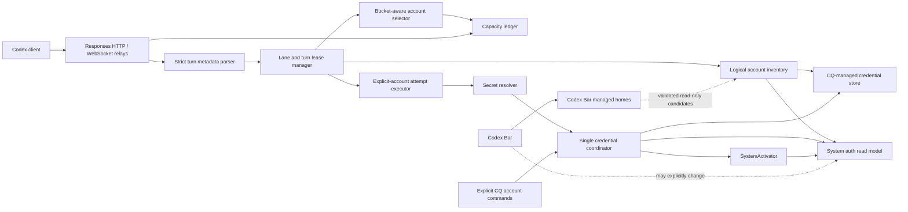

# Codex Turn-Aware Account Routing Design

- **Status:** Approved; implementation in progress; HTTP enforcement complete, WebSocket enforcement gated
- **Date:** 2026-08-08
- **Scope:** Codex credential authority, quota-aware selection, native Responses HTTP/WebSocket routing, and automatic backend-window priming
- **Implementation plan:** [`../plans/2026-08-08-codex-turn-aware-routing.md`](../plans/2026-08-08-codex-turn-aware-routing.md)

## Outcome

CQ becomes routing authority for Codex traffic without becoming global system-account authority.

- CQ keeps one logical catalogue of accounts and preserves distinct system, CQ-managed, and external read-only credential candidates.
- Codex Bar remains an independent usage and account manager. CQ may consume its declared managed accounts as live read-only candidates, but never copies, refreshes, activates, removes, or rewrites them.
- Automatic routing never writes `~/.codex/auth.json` or changes registry active state.
- Explicit account-management commands use one isolated system-activation capability.
- Each Codex agent turn receives an account lease. Parallel turns have independent leases.
- Quota depletion after admission affects future turns only. It never moves an admitted turn to another account.
- A different real turn ID on the same session/thread lane supersedes the previous turn and can choose a different account after any upstream-WebSocket continuation has been safely reset.
- CQ discovers rate-limit windows from provider usage responses and can automatically start each newly reset window with the minimum coalesced set of account-pinned synthetic requests.

This design fixes both current failure classes: stale managed credentials shadowing a fresh system credential, and request-level failover changing global auth while unrelated turns are active.

## Goals

1. Keep a long-running admitted turn on its original account after that account reaches its usage limit.
2. Let new turns, including turns in parallel tasks, immediately select another account with usable capacity.
3. Stop CQ and Codex Bar from fighting over the system account.
4. Retain accounts discovered through either CQ or the system auth file instead of silently losing or collapsing them.
5. Recover from stale credentials by trying another credential for the same identity before changing account identity.
6. Route base and model-scoped quota independently, including Spark quota.
7. Preserve context across account changes at verified turn boundaries.
8. Make the migration staged, observable, race-tested, and reversible without restoring unsafe system-auth writes.
9. Use current Codex Bar credentials without creating another independently rotating copy.
10. Prime provider-declared quota windows automatically without hard-coded window durations or manual requests.

## Non-goals

- Writing Codex Bar state, depending on Codex Bar implementation internals beyond its versioned account manifest, or asking Codex Bar to change its behaviour.
- Mirroring every CQ routing decision into the system account.
- Moving a turn between account identities after upstream admission.
- Treating `response.completed` as whole-agent-turn completion.
- Implementing a full Codex app-server facade in this migration.
- Making translated Anthropic or Live/realtime traffic turn-aware without an exact Codex turn identity.
- Supporting multiple Codex credential writers. CQ's existing no-file-lock policy remains in force; one local coordinator serialises supported writes instead.
- Implementing Anthropic window priming in this Codex migration. The resolver boundary remains provider-neutral so Sonnet-, Fable-, or later family-scoped windows can add a provider adapter without changing scheduler semantics.

## Current failure chain

Current source has five independent decisions that must be unified:

1. `DiscoverAccounts` reads live `~/.codex/auth.json`, then replaces a matching live candidate with the managed `~/.codex/accounts/*.auth.json` candidate. A stale managed token can therefore hide a fresh system token.
2. Quota fetch, scheduled refresh, and model-registry lookup can each rotate and persist Codex credentials.
3. `PersistCodexAccount` mirrors a managed refresh into system auth when a stale `IsActive` snapshot says the account is active.
4. Proxy 401/429 paths call `Accounts.Switch` asynchronously, changing global system auth for every Codex process and every concurrent turn.
5. Codex Bar and CQ keep separate per-account credential files. A Codex Bar login rotates only its managed home, while CQ continues probing an older `~/.codex/accounts` copy and reports `auth_expired` for the same logical identity.

Current selection is request-scoped for HTTP and physical-connection-scoped for WebSocket. It has no turn key, admission boundary, or same-thread successor boundary. It also ranks all model requests with `MinRemainingPct`, which ignores a matching scoped quota whenever shared windows exist. An account with exhausted base quota and available Spark quota is consequently rejected for Spark.

Two containment defects are independent of the refactor:

- Missing identity claims can produce the non-identity `RecordKey` value `"::"` and collapse unrelated malformed records.
- Proxy diagnostics can fall back to an access token as an account identifier. That fallback must be removed before further routing work.

## Protocol constraints

Design is grounded in official Codex tag `rust-v0.146.0`, commit `e363b08c9175ac1cbe5893615dd2cb9ddf95043b`, installed Desktop tag `rust-v0.147.0-alpha.6.5`, commit `618b8e9111da9f57fe380b09d0f6516e3f343536`, plus current CQ source.

### Turn identity is available

Codex emits canonical metadata as JSON in `x-codex-turn-metadata` and in `client_metadata["x-codex-turn-metadata"]`. Compatibility fields may also appear flat in `client_metadata`.

Relevant fields are:

- `session_id`
- `thread_id`
- `turn_id`
- `request_kind`
- `window_id`

`request_kind` can be `turn`, `prewarm`, `compaction`, or `memory`. Memory requests deliberately lack turn identity.

These identifiers are execution identity, not credential identity:

- `session_id` identifies one root multi-agent execution tree. A root thread and its spawned subagent threads share it. For a normal root without subagents it commonly equals the root thread ID.
- `thread_id` identifies one conversation/task lane within that tree. Each root or subagent thread has its own ID and at most one active turn.
- `turn_id` identifies one agent run inside that thread. Codex 0.146 currently generates UUIDv7 values, but CQ treats them as opaque and compares only equality or difference; it never depends on arithmetic increment or lexical ordering.

The lane key is `(session_id, thread_id, "codex-responses")`. The full lease key adds `turn_id`. Turn IDs are compared only inside their lane; unrelated parallel threads can advance independently even when they share a session.

User-message count is not a boundary. Input steered or delivered while a thread has an active turn joins that turn, and subsequent provider sampling retains its existing turn ID. Only provider traffic carrying a different real turn ID creates a routing successor on that thread lane.

WebSocket handshake metadata is only a hint. Codex can cache one physical WebSocket across turns, so CQ must inspect every `response.create` frame and prefer frame metadata over handshake metadata.

### Provider completion is not the routing boundary

One agent turn can issue multiple Responses sampling requests around tool execution. `response.completed` ends one sampling request. It does not end the agent turn.

At the Responses boundary CQ can observe sampling completion, failure, connection loss, and a new turn ID. It cannot distinguish exact whole-turn terminal reasons such as completed, interrupted, or failed. Routing does not require that distinction.

Codex permits only one active turn per thread. Once no selection, retry, or provider attempt for the predecessor remains active, the first well-formed request carrying a previously unseen real `turn_id` on the same lane is the authoritative successor boundary. CQ atomically advances the lane and creates the new reserving lease. A nonterminal predecessor becomes `superseded`; an already terminal predecessor keeps its terminal tombstone state. This applies even when the predecessor is `continuation_pending`: the changed turn ID proves that Codex ended or interrupted that turn above the Responses boundary. Exact terminal reason remains unknown and unnecessary.

Opaque inequality alone is insufficient because a delayed request for an older turn could arrive after its successor. CQ retains keyed seen-turn tombstones per lane for the lease-retention horizon. A non-current ID matching retained history is stale, never a successor: it fails closed and cannot move the lane pointer or current account. An unseen ID may advance the lane; CQ does not parse UUID timestamps to decide order.

CQ keeps a lease after `response.completed`: quiescent for `end_turn=true` or absent, and continuation-pending for `end_turn=false`. If no successor arrives, the mapping remains available for later same-turn sampling and bounded restart recovery. If a successor arrives while earlier routing work remains active, CQ rejects it as a concurrency/protocol violation rather than moving either operation.

### Continuation can cross turns

Codex 0.146 can reuse a physical WebSocket and `previous_response_id` across agent turns. That incremental state belongs to the exact live upstream WebSocket generation, not merely to an account. Even a same-account upstream reconnect clears the cached predecessor and requires a full `response.create`.

CQ must bind continuation to `(AccountKey, UpstreamSocketGeneration)` and never forward an incremental request after that generation is gone. Account rotation or reconnect requires one of:

1. a full request with no socket-bound continuation;
2. a verified client resynchronisation that makes Codex discard the downstream socket and retry the full logical request; or
3. continued use of the same live upstream generation.

`x-codex-turn-state` is per logical turn and must not be treated as cross-turn continuation. Startup prewarm is the only hand-off exception because its session becomes the first regular turn's session.

A syntactically full request is not automatically account-portable. Remote compaction can place opaque `encrypted_content` into reconstructed history. Until two-identity acceptance proves that state portable, its presence is account-affinity evidence: cross-account rotation retains predecessor affinity or fails closed even when `previous_response_id` is absent.

This is a promotion gate, not an implementation detail. Silent removal of `previous_response_id`, forwarding it on a replacement socket, or carrying turn state between ordinary turns would lose or corrupt context and is forbidden.

### Native request forms affect the relay

Codex enables zstd request compression by default. CQ must perform bounded decoding for metadata and model inspection while retaining the original encoded bytes for an unchanged retry. Decoded-size and expansion-ratio limits apply before allocation.

The canonical nested turn-metadata value can exceed 64 KiB because current Codex keeps unbounded Code Mode tool mappings in `client_metadata` while deliberately omitting them from the direct compatibility header. CQ therefore bounds nested metadata by the already bounded decoded protocol request size, ignores unrelated fields during typed extraction, and retains the stricter 64 KiB limit for the direct header and turn state. Installed observe acceptance must distinguish request-decode errors, metadata-parse errors, and missing turn identity without recording payloads or raw identifiers.

`/responses/compact` and its `/v1` alias are unary JSON, not SSE. They share the same logical turn namespace and lease manager as HTTP and WebSocket `/responses`, but have their own response parser and admission rules.

### Current `/app-server` route is invalid

The current handler expects an initial `thread/start` frame, then forwards app-server JSON-RPC to backend `/responses`. A real app-server requires `initialize`, `initialized`, thread start/resume, and `turn/start`; backend Responses WebSocket expects `response.create`.

Decision: retire CQ's current `/app-server` relay and fail closed with an explanatory response. Keep the actual Codex app-server local and route its outbound Responses traffic through CQ. A genuine app-server facade is unnecessary for account-routing correctness; it would add exact terminal-reason diagnostics only and remains separate work.

## Invariants

### Permanent containment

These rules become mandatory in Stage 1 and are never rolled back.

1. System auth is read-only to automatic code.
2. Automatic routing never calls `Accounts.Switch`.
3. Account identity never falls back to token material.
4. A system credential is never automatically refreshed by CQ.
5. Standalone refresh, ordinary quota checks, scheduled refresh, and model-registry reads never exchange or persist Codex tokens directly. After Stage 5 they may request an eligible coordinator-owned refresh.

### Credential-authority invariants

These become mandatory as Stages 2–4 introduce their owners, then are never rolled back.

1. One `CredentialCoordinator` serialises every supported managed-credential mutation and every explicit system-auth mutation.
2. Only its `SystemActivator` capability writes `~/.codex/auth.json` and registry active state, and that capability is reachable only from explicit account-management actions such as `cq codex switch`, `cq codex remove`, and explicit `cq codex login --activate`.
3. One logical account can own multiple credential candidates. UI and JSON still render one account row.
4. A managed credential is automatically refreshed only when CQ owns a never-exported OAuth lineage.
5. A second coordinator cannot start, and mutating commands never fall back to direct file writes when coordination is unavailable.
6. External credential sources are read-only capabilities. Automatic code may resolve an exact declared candidate revision for dispatch, but cannot copy, refresh, activate, remove, or rewrite it.

### Target routing invariants

These become mandatory when their owning stage enables turn-aware routing.

1. A turn's account identity becomes immutable at admission.
2. Same-identity credential replacement is allowed; different-account migration after admission is not.
3. A pre-admission 401/403 or hard usage 429 may change the provisional candidate or account. Network errors, 5xx, and soft/unknown 429 do not justify account migration.
4. `response.completed` makes a lease quiescent or continuation-pending, never released.
5. Each `(session_id, thread_id, "codex-responses")` lane has at most one current real turn. The same turn ID reuses its lease; a different valid unseen turn ID advances the lane after predecessor selection, retry, and attempt work drains; a retained historical turn ID fails closed as stale. CQ never infers order from turn-ID value.
6. Parallel turn keys never share mutable lease state or failover suppression.
7. New-turn selection is model/quota-bucket aware and chooses account, effective model, and required buckets as one decision.
8. Incremental input stays on its exact live upstream WebSocket generation; a lost generation requires full-request resynchronisation even when the account is unchanged.
9. Raw credentials, emails, account IDs, paths, turn IDs, thread IDs, response IDs, and prompt bodies never enter ordinary route diagnostics or the lease journal.
10. Credential commits and lease commits are atomic, serialised by their declared owner, revision/generation-fenced, and permissioned `0o600` under a `0o700` directory.
11. Once admission is observed in memory, persistence failure can only fail closed; it can never make the attempt provisional or migratable again.

## Authority model

| State | Authority | Automatic access | Explicit access |
|---|---|---|---|
| Coordinator ownership | One supervised per-user coordinator instance | Broker RPC only | Mutation RPC only |
| System-active identity and credential | `~/.codex/auth.json` | Read and reconcile only | Activate, replace, or remove through coordinator-scoped `SystemActivator` |
| CQ-managed credentials | `~/.codex/accounts/*.auth.json` during compatibility period | Resolve; refresh eligible CQ-owned lineage through coordinator | Login, remove, import through coordinator |
| Codex Bar managed credentials | Codex Bar versioned account manifest and declared managed homes | Validate, reconcile, and resolve exact read-only candidate revisions | None through CQ |
| Credential provenance and revisions | Namespaced metadata in each managed record | Read; coordinator writes | Coordinator reads/writes |
| Registry active key | Derived interoperability projection | Read only | Updated after successful explicit activation |
| Usage/capacity | Quota cache plus live response observations | Read/write | Read |
| Window-primer schedule | CQ privacy-safe primer journal | Read/write when explicitly enabled | Enable, disable, inspect, and configure model overrides |
| Per-turn routing | CQ lane/lease manager and journal | Read/write | Diagnostic inspection only |

`Active` in existing account output continues to mean “matches current system identity.” It does not mean “used by every proxied turn.” Lease ownership stays out of ordinary account JSON.

## Target architecture



Automatic proxy wiring receives read-only inventory, secret resolver, selector, capacity, and lease capabilities. Only the attempt executor receives the secret resolver. Neither routing object receives `SystemActivator`; explicit mutation RPCs are dispatched to it by the coordinator. This makes accidental global switching impossible by construction.

## Credential model

### Logical accounts and candidates

Replace the collapsed `[]CodexAccount` discovery result internally with:

```go
type AccountKey string
type CandidateID string
type LineageID string
type Revision string

type LogicalAccount struct {
    Key        AccountKey
    Identity   AccountIdentity
    Candidates []CredentialCandidate
    Active     bool
}

type CredentialCandidate struct {
    Ref              CandidateRef
    Source           CredentialSource // system, managed, or declared external
    Provenance       CredentialProvenance
    Lineage          LineageID
    AccessExpiresAt  time.Time
    RefreshOwnership RefreshOwnership
}
```

`AccountKey` is a persisted opaque CQ identifier, not a value recomputed from whichever claims happen to be present today. Reconciliation associates candidates by ordered evidence:

1. exact provider account ID or fully populated existing `RecordKey`;
2. exact subject/user ID plus organisation/tenant when present;
3. user ID or normalised email only as display/explicit-resolution aliases; neither alone auto-merges records.

Conflicting strong identifiers never merge. Weak-only ambiguity produces separate non-routable diagnostics until an explicit operation resolves it. When richer claims arrive, aliases attach to the existing `AccountKey`; they do not create a new logical account or change journal identity. Key merge/split is an explicit, revision-fenced migration.

`RecordKey` is invalid unless it contains real identity components. Unidentified records remain diagnostic candidates until validation associates them with a durable opaque key; they never use an access token as identity.

`CandidateID` identifies source and record without containing a raw path or secret. `Revision` fingerprints exact credential material for compare-before-commit and stale-result rejection; it is never logged.

### Provenance and commit unit

CQ records non-secret provenance in a namespaced `_cq` object inside each CQ-managed account record:

- `cq_oauth`: issued by an explicit CQ login;
- `system_borrowed`: copied from system auth so an otherwise unseen account does not disappear;
- `legacy_unknown`: existing managed record without trustworthy ownership metadata.

Three closed persisted enums keep decisions unambiguous:

- `Provenance`: `cq_oauth | system_borrowed | legacy_unknown`;
- `RefreshOwnership`: `cq_owned_never_exported | exported_to_system | unknown`;
- `OperationState`: `ready | refreshing | rotation_uncertain | activation_pending | removing`.

Unknown enum values suspend refresh. `exported_to_system` is absorbing for a lineage. Refresh is permitted only when provenance is `cq_oauth`, ownership is `cq_owned_never_exported`, and operation state is `ready`.

Credential material, `_cq` candidate ID, lineage ID, provenance, ownership state, operation ID, generation, and revision form one atomic JSON commit unit. This avoids a credential/sidecar split-brain after a crash. Writes use a unique temporary file, `fsync`, permission check, rename, and parent-directory `fsync`; recovery accepts only a complete record with a valid generation. Unknown fields remain round-trippable. Explicit activation strips `_cq` while merging credentials into the independently preserved system-auth document.

On first discovery of an unseen system identity, the read model reports an adoption intent. Only the credential coordinator may commit it as `system_borrowed`; discovery itself never writes. On later reconciliation the coordinator rolls that borrowed snapshot forward from a newer matching live system revision. It never overwrites `cq_oauth` or `legacy_unknown`. If a CQ-owned record already exists for that identity, CQ retains both live and managed candidates in memory.

Existing files are read without destructive migration. Unknown JSON fields are preserved on every managed write and explicit activation.

### External candidate federation

External account managers remain authorities for their own credential copies. CQ consumes them through narrow source adapters rather than importing another snapshot:

```go
type ExternalCredentialSource interface {
    List(context.Context) ([]ExternalCandidateDescriptor, error)
    Resolve(context.Context, CandidateRef, Revision) (CredentialMaterial, error)
}
```

The Codex Bar adapter reads only its versioned managed-account manifest and the exact managed-home `auth.json` paths declared there. It validates that each path is rooted under Codex Bar's managed-home directory, is a regular user-owned file with restrictive permissions, matches the manifest's strong provider identity and auth fingerprint, and still has the expected revision at secret resolution. It does not scan arbitrary application-support paths, databases, browser data, cookies, or keychain secrets.

External candidates join logical accounts only through the same strong-identity reconciliation rules as system and managed candidates. Their `CandidateID` contains source namespace plus opaque manifest record ID; ordinary output never exposes the source path. A changed manifest fingerprint or credential revision creates a new candidate generation. If the file changes between planning and resolution, dispatch replans instead of using mismatched material.

External candidates have no CQ provenance, lineage ownership, refresh eligibility, activation capability, removal capability, or adoption intent. A fresh external candidate can outrank or follow a stale CQ candidate under normal expiry ordering. Candidate-specific 401/403 rejection then advances to another same-identity candidate. Only after every same-identity source is exhausted may a provisional request choose another logical account.

Copying an external credential into CQ is not automatic recovery: it would create another independently rotating refresh lineage and reproduce the divergence this adapter removes.

### Candidate ordering

Credential choice is independent from account choice. For one bound account:

1. Keep the candidate revision already accepted for that lease unless its generation is rejected.
2. Try another declared-unexpired candidate.
3. Try an unknown-expiry candidate.
4. Treat a locally expired candidate as a last-resort probe because legacy expiry metadata is not fully trustworthy.
5. Within one class, prefer a CQ-authored generation, then later access-token expiry, then a stable `CandidateID` tie-break.

`last_refresh` and file mtime are diagnostic hints, not authority. A 401/403 for a revision overrides timestamp heuristics immediately.

Discovery never uses “managed always wins” or filesystem order. It preserves source candidates and renders one logical account.

### 401/403 recovery order

For a request whose account identity is still mutable:

1. reject the failed candidate revision in the broker's generation-scoped rejection set;
2. try each remaining distinct access candidate for the same `AccountKey`;
3. if eligible, run one coalesced refresh of a CQ-owned managed lineage;
4. durably commit the refresh, replace the lease's accepted revision, and retry the same account;
5. only then select another account while the lease remains provisional.

For an admitted turn, steps 1–4 remain allowed because account identity is unchanged. Step 5 is forbidden.

### Refresh ownership

Refresh-token rotation is a write-authority problem, not only a freshness problem.

- CQ never refreshes the system candidate.
- If managed and system candidates share a refresh token, ownership becomes absorbing `exported_to_system` and refresh-suspended.
- `system_borrowed` and `legacy_unknown` are always refresh-suspended.
- A CQ-issued lineage is refreshable only while `Provenance == cq_oauth`, `RefreshOwnership == cq_owned_never_exported`, `OperationState == ready`, and provider-contract tests prove CQ login created an independent lineage.
- Explicit activation irreversibly marks that lineage `exported_to_system`; later token inequality or a later system-account switch cannot prove independence, so it stays refresh-suspended. A new explicit CQ login creates a new lineage rather than clearing that history.
- Equality may prove sharing; inequality never proves independence.
- Refresh persistence failure is a typed failure. The rotated response is not considered usable until atomically committed.

Refresh uses a crash-recoverable operation state in that same record:

1. commit `refreshing(expected_revision, operation_id)` before contacting OAuth;
2. on success, commit new credentials and `ready(new_revision)` in one replacement;
3. on uncertain network outcome or final-commit failure, leave `refreshing` or, when writable, `rotation_uncertain`; recovery treats both as uncertain and never retries the old refresh token;
4. while still alive, the coordinator may retry only the local commit using the already-returned refresh response;
5. missing, corrupt, or mismatched `_cq` metadata becomes refresh-suspended `legacy_unknown`.

To preserve the repository's no-file-lock decision, one supervised per-user credential coordinator is the only managed-credential writer. A fixed Unix socket under a `0o700` CQ state directory is the writer-ownership capability. The installed proxy normally owns it. Mutating commands connect using typed local RPC; if no owner exists, a command may bind the endpoint and run an ephemeral coordinator for its transaction. An existing but unreachable endpoint fails closed and requires explicit stale-owner recovery. Callers never fall back to direct writes.

A second proxy delegates to the owner or runs with automatic refresh disabled; it cannot become another writer. Platforms without a proven exclusive local endpoint keep automatic refresh disabled.

`cq refresh`, ordinary `cq check`, scheduled refresh, and model-registry discovery become read/reconcile paths for Codex. They can use another fresh candidate, report `auth_expired`, or request an eligible refresh from the coordinator; they never exchange a refresh token themselves.

The coordinator holds one per-lineage operation across refresh exchange, durable commit, activation, removal, and adoption conflicts. Expected revisions reject stale RPCs. Before activation it drains in-flight refresh, commits `activation_pending`, writes system auth, then commits absorbing `exported_to_system`; recovery treats `activation_pending` as exported and refresh-suspended. Singleflight coalesces identical refresh requests but is not the cross-process safety mechanism. Two-process startup and mutation races must prove that only one exchange or commit occurs.

### Explicit activation

`SystemActivator.Activate` performs one ordered transaction inside the coordinator:

1. resolve an unambiguous `AccountKey` and candidate revision;
2. durably adopt the outgoing live account when needed;
3. atomically replace system auth;
4. update registry active state as a derived projection;
5. return a typed outcome distinguishing committed system auth from registry-projection failure.

`SystemActivator.Deactivate` removes system auth only for the expected active `AccountKey` and revision, then updates the registry projection. `RemoveManaged` deletes all managed candidates for one unambiguous logical account. Removing a system-active account explicitly deactivates it in the same coordinated operation; removing an account with a bound lease is refused unless an explicit force flag accepts a later continuity error. Email remains a CLI compatibility alias only when it resolves to exactly one logical account. Non-activating login must not change registry active state. `login --activate` activates the exact candidate returned by `SaveLogin`, never a rediscovered email match. Automatic code never receives this interface.

Because removal spans candidate files, optional system auth, and registry projection, the coordinator first commits a non-secret removal journal entry containing operation ID, exact candidate IDs/revisions, expected system revision, and force decision. Restart finishes that exact set idempotently before another mutation; it never rediscovers and widens the deletion. File deletion and parent-directory metadata are synced. `RemovalResult` distinguishes managed deletion, system deactivation, registry-projection warning, and pending recovery. Errors mean no unjournalled wider removal occurred.

## Capacity and account selection

Introduce a `CodexCapacityLedger` keyed by `AccountKey` and workload bucket.

Inputs, newest trustworthy observation first:

- `codex.rate_limits` WebSocket events;
- HTTP response rate-limit headers;
- hard usage-limit errors and reset metadata;
- usage API/cache snapshots.

Before admission, CQ buffers bounded `codex.rate_limits` frames, updates only the provisional candidate's ledger, and preserves order. It flushes them byte-for-byte when that candidate is admitted or its terminal error is surfaced; it discards them with a rejected provisional attempt so another account never inherits their telemetry. After admission, events forward immediately. Parsing failure never changes accepted client-visible content.

Each fact carries source, local observation sequence, upstream connection generation where applicable, observed time, provider reset time, and confidence. Per-source sequence and connection generation fence late events. A hard-429 zero creates a bucket fence until its reset time; an older usage snapshot cannot revive it. A later positive live event can lift it only when its generation/observation order is provably newer. Facts become `unknown/stale` at their provider reset or the existing configured quota-cache horizon, whichever comes first. Out-of-order and reset-epoch behaviour is deterministic under a fake clock.

Workload buckets:

- base models use shared windows;
- a model with exact scoped windows, such as Spark, uses those scoped windows instead of an exhausted base window;
- if no exact scoped data exists, selection falls back to shared capacity as unknown/compatible policy permits.

Selection returns one indivisible `RouteChoice { AccountKey, RequestedModel, EffectiveModel, RequiredBuckets }`. Ordinary requests carry one bucket; pre-turn compaction can require both compaction-attempt and target-turn buckets. This preserves current model-rewrite fallback: exhausted Spark capacity may select a compatible base model/account only when existing policy permits that rewrite, and capacity is then evaluated against the effective model's bucket.

New-lease eligibility order:

1. model/plan compatible and known positive capacity;
2. compatible with unknown/stale capacity;
3. known zero is ineligible. If every compatible route is authoritatively zero, return the cached typed usage-limit outcome; do not probe accounts merely to rediscover it.

Known remaining percentage ranks candidates. Active lease count is only a tie-break to avoid equal-capacity stampedes. System-active status is display metadata, not an automatic routing preference.

Existing admitted leases bypass capacity eligibility. Mid-turn zero updates the ledger for future turns and leaves the current account unchanged.

## Backend-discovered quota-window priming

Window shape is provider authority. CQ never asks users to configure `5h`, `7d`, or later durations. Every usable usage response is normalised into descriptors that retain provider, raw limit name, canonical duration, scope, remaining percentage, and exact reset epoch:

```go
type WindowDescriptor struct {
    Provider     provider.ID
    RawLimitName string
    WindowName   quota.WindowName
    Period       time.Duration
    Scope        WindowScope // shared or model-family
    ResetAt      time.Time
    RemainingPct float64     // exact backend percentage, not display-rounded
}
```

Shared primary/secondary windows have `ScopeShared`. Each `additional_rate_limits[].limit_name` produces a distinct model-family scope while preserving the raw backend name. The current Codex parser's canonical names such as `7d` and `7d:GPT-5.3-Codex-Spark` remain display and cache keys; scheduling never infers semantics from duration text alone.

Priming is explicit opt-in at feature level, but window enumeration is automatic. User configuration contains only `enabled` and optional exact raw-scope-to-model overrides. Missing, added, removed, or resized backend windows require no config change.

### Activation planning and model resolution

The scheduler converts due descriptors into activation targets, then coalesces targets that one request can satisfy:

- one general model request activates every simultaneously due shared window for that account;
- one request for a scoped model family activates only that family's due windows unless installed acceptance proves an additional capability;
- shared and scoped windows stay separate even at one epoch when provider capability is unproven;
- different model families remain separate activation targets;
- different reset epochs remain separate schedules even when their periods match.

Scoped-model resolution is deterministic:

1. exact user override for provider plus raw backend scope;
2. case-folded exact registry model ID, alias, or display-name match;
3. unique token-boundary family match across visible provider models;
4. explicit provider adapter for an exceptional backend name;
5. otherwise unresolved and fail closed with a safe diagnostic naming only the backend scope.

Arbitrary substring matching is forbidden because short names such as `pro` can collide with unrelated families. Token-boundary matching is accepted only when every match belongs to one inferred family and registry preference/version ordering yields one deterministic visible model. Current `GPT-5.3-Codex-Spark` resolves exactly to its registry slug. A future Anthropic adapter can resolve `Sonnet`, `Fable`, or later family names through the same contract.

For a shared target, CQ selects the registry-preferred visible non-Spark Codex model. Installed acceptance proved Spark traffic starts the Spark-specific window but does not start the shared window, so Spark is not a compatible shared capability and CQ never coalesces these targets. Current registry has no price metadata, so CQ must not label the general choice “cheapest”. If pricing or explicit capability metadata becomes authoritative later, provider policy may use it without changing scheduler state. An explicit model override always wins only when it names a model compatible with that scope.

### Scheduler, request, and verification

One long-lived scheduler uses active per-account usage fetches through the candidate inventory. It never activates system auth. Codex currently reports an untouched window as exact `100%` remaining with `reset_at` approximately one full backend period after each observation. That epoch slides forward with observation time until first admitted model traffic starts the countdown. CQ therefore distinguishes two activation paths for each account/window generation:

1. persist the observed reset epoch and activation target;
2. for an active countdown, wake at or after its stable epoch;
3. for an exact-`100%` candidate whose horizon approximately equals its backend period, sample again after a short probe interval and classify it as untouched only when its epoch shifts by approximately the elapsed observation time;
4. refresh usage before sending model traffic;
5. if a due active epoch already advanced, record `primed_externally` and send nothing;
6. otherwise atomically claim one window-lineage attempt and issue the coalesced account-pinned request;
7. after admission/completion, poll usage only: active-reset verification requires epoch advancement, while untouched-window verification requires the post-request epoch to remain exactly stable across a later probe;
8. record verified activation and schedule the stable backend epoch.

A stable fresh epoch is already counting down and receives no synthetic request. Percentage must be the exact backend value: display rounding to `100%` cannot establish untouched state. Sliding detection requires two observations and never treats one future epoch as proof. Window-lineage identity excludes the sliding epoch, so a shifted record cannot bypass admission safety or retry limits.

Synthetic traffic uses native Responses HTTP with `store:false`, no tools, no continuation, a minimal `ping` instruction, a bounded response, and a dedicated CQ synthetic metadata namespace. It never joins, creates, or mutates a user task lease. It uses one exact `AccountKey`; same-identity candidate fallback and one eligible coordinator refresh are allowed, but cross-account failover and automatic system activation are forbidden.

A definitely rejected pre-admission request may retry under a bounded provider-lag policy. The attempt bound applies to stable window-lineage identity across changing untouched epochs, not to each reset timestamp. Once admission is observed, bytes may have reached upstream, or outcome is ambiguous, CQ never repeats that account/window/model-capability attempt. It performs verification polls only. If the epoch keeps sliding and later installed evidence removes that model from the window's compatible capability set, CQ durably retires the old attempt as `model_incapable`; one separately claimed compatible capability may then run. This is a model-capability correction, never replay of the admitted capability. Remaining percentage alone is never verification because one minimal request can still display as `100%`. Scoped and shared verification remain separate.

Primer state is a separate atomic `0o600` journal under a `0o700` CQ state directory. It stores HMAC account identity, provider, raw-scope hash, canonical period, observed reset epoch, selected model ID, attempt generation/state, next verification time, and typed result. It stores no credential material, email, provider account ID, prompt, response text, or external path. Restart resumes due schedules and verification without replaying an admitted or ambiguous generation.

Initial live acceptance must use a naturally reset untouched window. Operators may install/restart the service, enable automatic priming, and inspect privacy-safe journal/status output, but must not manually call usage or send a model request after acceptance begins. Success requires scheduler-only two-sample sliding detection, scheduler-originated admission, and a later scheduler poll proving the epoch stopped sliding. Failure preserves the untouched generation for diagnosis whenever no request was admitted; admitted/ambiguous failure remains verification-only.

## Turn identity and lifecycle

### Strict extraction

For HTTP, parse the bounded direct metadata header and request `client_metadata`. For WebSocket, inspect every bounded `response.create` text frame. Priority within the current request/frame is:

1. `client_metadata["x-codex-turn-metadata"]` JSON string or object, bounded by decoded protocol request size;
2. direct `x-codex-turn-metadata` header for HTTP;
3. flat compatibility `session_id`, `thread_id`, and `turn_id` fields;
4. handshake metadata only until a frame supplies current metadata.

The canonical lane key is `(session_id, thread_id, "codex-responses")`; the canonical lease key is `(session_id, thread_id, turn_id, "codex-responses")`. `codex-responses` is one transport-independent namespace shared by HTTP `/responses`, WebSocket `/responses`, and `/responses/compact`; transport fallback must not split a turn. Generic recursive fields, `previous_response_id`, window ID, user agent, and current diagnostic session heuristics are not turn identity.

CQ keeps one generation-fenced current-turn pointer per lane. Request handling compares opaque IDs:

1. turn ID matches retained non-current history: fail closed as a stale request;
2. no current real turn and ID is unseen: create its reserving lease;
3. same real turn ID as current: reuse its existing account and attempt rules;
4. different unseen real turn ID while predecessor selection, retry, or provider-attempt work is active: reject as a concurrency/protocol violation;
5. different unseen real turn ID with no live predecessor routing work: atomically advance the lane generation, transition any nonterminal predecessor to `superseded`, retain any terminal predecessor tombstone, and create the successor's reserving lease before selection/dispatch.

Step 5 does not wait for `turn/completed`, `response.completed`, or new-turn admission. A well-formed unseen successor request is enough because Codex serialises turns within one thread. If successor dispatch later fails before admission, the predecessor remains historical in its superseded or terminal state and the successor ends `failed_unadmitted`; CQ never reopens the old turn as current. Late predecessor requests fail against retained history. Late predecessor events retain their original attempt/account generation and cannot affect the lane pointer or successor.

An empty `turn_id` is valid only for `request_kind=prewarm`, where it becomes a typed startup-prewarm sentinel scoped by session, thread, and live downstream socket generation. Empty IDs for ordinary turns and compaction are invalid.

Within one real turn, the first upstream `x-codex-turn-state` value wins and later requests, retries, or HTTP fallback must echo it on the same account. A new real turn must begin without predecessor turn state. Startup prewarm may transfer its first value to the adopting turn; any other cross-turn state is a protocol anomaly and fails closed.

Malformed, incomplete, or oversized metadata falls back safely:

- without continuation evidence, HTTP remains request-scoped and WebSocket remains downstream-connection/account scoped;
- `previous_response_id` requires a matching live lease and exact upstream WebSocket generation or fails closed;
- turn state requires the matching lease/account and exact immutable value, including during HTTP fallback; it does not require a live WebSocket generation;
- opaque encrypted provider state requires predecessor account affinity until portability is proven;
- metadata-less HTTP never performs multi-account selection across related continuation requests;
- no cross-account or cross-upstream-generation continuation occurs.

### Request kinds

- `turn`: owns the logical turn lease.
- `prewarm`: sends a real `generate=false` request under the typed empty-turn sentinel and uses only the dedicated reservation lifecycle below. The first real-ID request, including `pre_turn` compaction, atomically adopts account, live upstream generation, response-chain correlation, and first turn state only when its correlation matches. A property mismatch that produces a portable full request may start independently. Restored prewarm is never inheritable because its socket lineage is extinct.
- `compaction` with `phase=mid_turn`: attaches to the exact admitted turn lease. Missing affinity fails closed.
- `compaction` with `phase=pre_turn`: is the first auxiliary attempt for a new turn. Before dispatch, select one account compatible with both the compaction request model and target turn model. If target model is unavailable in verified metadata, or compaction state is not proven portable, retain predecessor/prewarm affinity or fail closed. Admission binds the new turn; later main sampling cannot reselect. Attribute quota to each attempt's actual request model/account.
- `compaction` with `phase=standalone_turn`: owns an ordinary logical turn and follows normal supersession rules.
- compaction with missing or unknown phase uses one account conservatively and cannot supersede or migrate a lease.
- `memory`: HTTP remains request-scoped; WebSocket inherits its existing socket account. It never creates, supersedes, or migrates a turn lease.

Live/realtime retains existing call-ID affinity. Translated Anthropic traffic stays request-scoped unless exact Codex metadata is present and verified.

### Two nested state machines

Logical lease states:

| State | Meaning | Allowed next states |
|---|---|---|
| `reserving` | Same-key selection is singleflight | `provisional`, `failed_unadmitted` |
| `provisional` | Account chosen; no upstream acceptance | another `provisional`, `bound_active`, `failed_unadmitted` |
| `bound_active` | At least one attempt active; account immutable | `continuation_pending`, `bound_quiescent`, `orphaned` |
| `continuation_pending` | `response.completed.end_turn=false`; same turn must sample again unless a different turn ID supersedes it | `bound_active`, `orphaned`, `superseded`, `expired` |
| `bound_quiescent` | Sampling ended; same turn may continue after tools | `bound_active`, `orphaned`, `superseded`, `expired` |
| `orphaned` | Transport lost, provider outcome uncertain, or journal restored without a live attempt | `bound_active`, `superseded`, `expired` |
| `superseded` | Different unseen real turn ID became current on the same lane | retain as stale-ID tombstone after active attempt references drain, then GC at retention horizon |
| `expired` | Operational cleanup only, never successful completion | tombstone/GC |
| `failed_unadmitted` | No upstream admission occurred | tombstone/GC |

Sampling attempt states:

`prepared -> dispatched -> streaming -> provider_completed | provider_failed | indeterminate`

`provider_completed` with `end_turn=false` enters `continuation_pending`; with `true` or absent it enters `bound_quiescent`, never whole-turn completion. An admitted `provider_failed` remains quiescent, while an indeterminate close/read/parser outcome becomes orphaned. A pre-admission failure remains provisional or ends as `failed_unadmitted`.

A different turn on the same downstream socket is rejected while its predecessor has active selection, retry, or provider-attempt work. With zero active broker work, changed turn identity supersedes a `continuation_pending`, `bound_quiescent`, or `orphaned` predecessor. CQ does not need exact terminal status and does not queue concurrent provider attempts; cancellation and backpressure remain deterministic.

Startup prewarm uses a separate reservation lifecycle:

`creating -> bound_active -> ready | failed | disconnected`; `ready -> adopted | expired`; `creating -> cancelled | failed`.

`creating` is mutable only before upstream acceptance. Pre-dispatch cancellation becomes `cancelled`; definite pre-admission failure becomes `failed`. `bound_active` fixes account and socket generation. Valid completion plus a reusable response anchor becomes `ready`; admitted failure becomes `failed`; uncertain disconnect becomes `disconnected` and retains account with extinct socket lineage. On the first matching real-ID request, including `pre_turn` compaction, one journal transaction creates the real lease with account, socket generation, keyed response anchor, and first turn state, then tombstones the empty-ID sentinel as `adopted`. A portable full request without matching continuation may create an independent lease.

### Admission

HTTP `/responses` and unary `/responses/compact` become admitted on accepted 2xx response headers. CQ captures response-header turn state and journals admission before forwarding headers.

A non-empty upstream WebSocket 101 `x-codex-turn-state` is also stateful acceptance. Before sending downstream 101, CQ binds and journals the account/socket reservation, attaching strong handshake turn identity when available. Otherwise the first matching `response.create` promotes that socket-scoped reservation. Other handshake metadata is non-admitting.

WebSocket admission occurs on the first of:

- `response.metadata` carrying first turn state;
- a well-formed `response.created` containing a response object;
- a response-scoped output, item, reasoning, function-call, or content delta event;
- any upstream response message CQ cannot safely buffer and classify before forwarding.

Known timing, ping/pong, non-state handshake metadata, and `codex.rate_limits` events are non-admitting. Pre-admission rate-limit frames stay in the bounded gate until that provisional attempt is accepted or rejected. A wrapped error before any admitting event remains pre-admission.

Relays use a bounded pre-admission gate. Unknown or malformed events commit to the current account and pass through; they do not trigger speculative failover.

Lease creation and every provisional account change are journalled before dispatch; immutable binding occurs only at admission. A `dispatched` attempt is journalled before the first upstream byte so restart recovery treats an uncertain outcome as orphaned, never provisional. On admission CQ first marks the lease bound in memory, then synchronously journals it before forwarding the admitting header/event. Journal failure closes/fails the current request and keeps the in-memory lease non-migratable; it never triggers alternate-account replay. Late events carry a generation and cannot mutate a newer attempt or lease.

### Durable journal and retention

Persist a privacy-safe lease journal under CQ's existing cache/config boundary. A random per-installation HMAC key is generated once in a separate `0o600` file under the `0o700` state directory. Records contain only:

- separate keyed hashes of session, thread, current and retained historical turns, stable account key, and any continuation/turn-state correlation value;
- lease, predecessor, mode-epoch, downstream-socket, and upstream-socket generations;
- state, request kind, compaction phase, protocol/schema version, and authoritative/shadow flag;
- creation and last-observed timestamps.

No tokens, paths, emails, raw IDs, response IDs, or request bodies are stored.

Rules:

- active stream references never expire;
- restart restores dispatched/admitted leases as orphaned and resolves the same account from current inventory;
- socket generations restored after restart are always marked extinct, so incremental input requires resynchronisation;
- a different well-formed unseen real turn ID for the same session/thread atomically advances the lane after predecessor selection, retry, and attempt work drains; nonterminal predecessors become superseded and terminal predecessor tombstones remain historical;
- quiescent, orphaned, and superseded stale-ID tombstones retain for seven days after last observation;
- a request matching a retained non-current turn hash fails closed and never advances the lane generation;
- seven days is an operational default, not a protocol guarantee;
- a late request with continuation evidence but no retained lease fails closed instead of silently choosing another account;
- key loss, unreadable/corrupt journal, permission failure, ENOSPC, or failed rename disables enforcement and fails closed for strong-turn or continuation-bearing traffic; it never silently starts a fresh authoritative journal;
- explicit key rotation rewrites hashes and journal under one stopped/drained coordinator transaction; there is no opportunistic rotation;
- journal replacement and compaction are atomic, serialised, crash-tested, and generation-fenced.

Longer retention can be exposed only if live evidence shows legitimate dormant turns exceed seven days. Arbitrarily long dormant correctness requires retention until supersession.

Resume cases stay distinct:

1. CQ-only restart restores same account and lease/predecessor generations, marks socket generations extinct, and requires full-request resynchronisation.
2. A running Codex task remains governed by its live in-memory client state and the matching lease.
3. Cold Codex resume reconstructs full history with an empty transport cache; old provider response chaining is not restored, and only a newly issued prewarm may create a new chain.

## Attempt and failover policy

| Signal | Provisional turn | Admitted turn |
|---|---|---|
| Candidate 401/403 | Try same-identity candidate; refresh eligible CQ lineage; then another account | Try same identity only; otherwise surface error |
| Hard usage 429 | Mark requested bucket unavailable; try another account | Update future capacity; surface error |
| Soft/unknown 429 | Surface unchanged | Surface unchanged |
| Network error / timeout / 5xx | Surface without account migration | Surface without account migration |
| `codex.rate_limits` | Update provisional ledger; buffer until attempt accepted/terminal | Update ledger and forward; never terminal |
| Provider event already forwarded | No replay | No replay |

Attempts use a bounded set of `AccountKey` and `CandidateID` values. They never depend on exclusion strings that can be empty or token-derived.

`hard usage 429` has one audited predicate for the bounded event/body: top-level `type == "error"`; `status` or `status_code == 429`; and nested `error.type == "usage_limit_reached"`. Missing, malformed, or near-match fields are soft/unknown and never authorise account migration.

Codex owns network/timeout/5xx retry budget, backoff, and WebSocket-to-HTTP fallback. CQ does not add a second retry loop. CQ's bounded attempts cover only same-identity credentials, pre-admission account selection, and one version-gated reconnect signal needed to realise a stored failover/resync intent. That intent survives downstream reconnect and WS-to-HTTP crossover, and is consumed only by the same turn's portable full request.

Replayable HTTP may perform bounded credential/account attempts before accepted 2xx headers. An established WebSocket never swaps upstream invisibly: a pre-admission 401/403 or hard 429 records the next candidate/account intent and uses a fixture-proven client retry signal; if the client cannot safely retry, CQ surfaces the original error. After WS admission, any transport failure invalidates the socket pair and the same bound account must be used after full-request reconnect.

## HTTP relay

Move native Responses HTTP handling out of `server.go` into a protocol-aware relay.

Responsibilities:

1. preserve the original encoded request and perform bounded zstd decoding for inspection, with decoded-size and expansion-ratio limits;
2. extract exact turn metadata and model bucket;
3. acquire/reuse lease;
4. send with an explicit account/candidate;
5. classify status, response headers, and bounded pre-admission SSE events;
6. retry only under the policy table;
7. stream all accepted bytes unchanged while observing lifecycle and capacity;
8. classify clean terminal, premature EOF, read error, early close, and cancellation.

Unchanged retry reuses the original compressed bytes. Any future body mutation must recompress and correct `Content-Encoding` and `Content-Length`; this migration does not mutate native request bodies. Unary `/responses/compact` has a separate bounded JSON response path but shares selection, lease, and admission machinery. Valid full-body EOF completes its attempt and leaves the lease quiescent; truncation, malformed body, read failure, or cancellation after accepted headers is indeterminate/orphaned.

`CodexTokenTransport` becomes pure explicit-account auth injection plus existing model rewriting. Selection, failover, suppression, persistence, and global switching leave the transport.

## WebSocket relay

Replace the blind two-pump `/responses` relay with a supervised frame broker.

Responsibilities:

- inspect every client `response.create`, not only first frame;
- require verified model-bearing handshake data before model-aware WS enforcement, and require the first frame to match it; otherwise retain connection-scoped affinity in `observe/off` and do not bind a quota-selected account before the model is known;
- support prewarm and repeated sampling requests for one turn;
- parse wrapped 401/403/429 errors before admission;
- parse and forward `codex.rate_limits`;
- forward required `OpenAI-Beta`, subprotocol, and semantic request headers upstream;
- dial the selected upstream before completing the downstream upgrade, then preserve upstream 101 semantics including `x-reasoning-included`, `x-models-etag`, `openai-model`, and first `x-codex-turn-state` in the downstream 101 response;
- before downstream upgrade, apply bounded provisional candidate/account recovery to upstream 401/403 or hard 429; if exhausted, pass final status, safe headers, and body through unchanged;
- pass final upstream 426 through without upgrading so Codex owns its HTTP fallback;
- negotiate permessage-deflate on each leg and preserve logical message payloads after decompression; physical WebSocket frames need not be byte-identical;
- keep one reader and one serialised writer per Gorilla connection;
- propagate close codes, downstream loss, request-context cancellation, deadlines, and server shutdown;
- recover panics in every relay goroutine and join both pumps;
- fence upstream generations so late close/events cannot alter a newer turn;
- keep a one-to-one downstream/upstream socket generation; never hide an upstream replacement behind an existing downstream socket;
- treat the configured 60-minute upstream lifetime and every WebSocket reconnect as a new generation that requires downstream reconnect and a new handshake; HTTP fallback is a transport crossover consuming the same intent;
- at a changed-turn successor boundary after the predecessor attempt drains, record rotation intent; account change becomes effective only after verified downstream reconnect.

For a later turn whose frame model changes, CQ may compute a new `RouteChoice` but cannot apply it behind the existing socket. It records intent and requires a new model-bearing handshake through the verified reconnect path. If the client cannot provide model before stateful 101 admission, WS account rotation stays disabled for that client build.

Ordinary Codex application cancellation is not a Responses wire event. If the downstream socket remains open, CQ keeps the sole active broker-local attempt generation and drains upstream through terminal/error before accepting another `response.create`. Generations are local counters, never inferred from response IDs or headers.

If a different turn arrives while earlier selection, retry, or sampling-attempt work is active, phase one rejects it with a typed concurrency error. After that work drains, the changed turn ID supersedes the predecessor even when its logical state remains `continuation_pending`. CQ does not queue or add multiplexing.

### Cross-account continuation reset

When an exact live upstream generation cannot be reused, including same-account reconnect, connection lifetime expiry, or cross-account rotation:

1. do not forward the triggering request to a replacement upstream;
2. retain a provisional reconnect/rotation intent for the turn;
3. emit at most one version-gated reconnect signal for that intent: for incremental input, the exact wrapped `previous_response_not_found` error without upstream dispatch; full-request cross-account rotation on an existing downstream socket remains forbidden until a separate signal is fixture-proven;
4. verify the client invalidates the old socket and sends the same turn's portable full request either on a new model-bearing WebSocket handshake/generation or over HTTP `/responses`; no graceful close handshake is required;
5. consume the stored intent once and dispatch that full request to the lease's account, or to the selected new account only when this is a new provisional turn;
6. if resynchronisation fails, keep the same live upstream generation when still available or surface a typed continuity error. Never drop history or guess.

Codex source maps the nested `previous_response_not_found` error to a retryable full-request path, but CQ must prove exact end-to-end behaviour for each supported client, including current Codex Desktop and `stream_max_retries` values 0, 1, and exhausted fallback. Error event, client invalidation, new WebSocket generation or HTTP crossover, and portable full request remain an acceptance test, not an assumed contract.

## Observability and privacy

Extend ordinary route diagnostics with safe fields:

- keyed `turn_hint`;
- request kind;
- lease phase and generation;
- decision: `new`, `reuse`, `candidate_retry`, `pre_admission_failover`, `resync`, `supersede`, `stale_block`, `retain`, `expire`;
- reason and capacity bucket;
- existing hashed account hint;
- continuity state.

Add aggregate `/health` data:

- effective routing mode;
- provisional, active, quiescent, and orphaned lease counts;
- pre-admission auth and hard-429 failovers;
- post-admission quota errors;
- resync attempts, successes, fallbacks, and blocks;
- unknown metadata/protocol events;
- late-resume blocks;
- stale historical-turn blocks;
- refresh-suspended lineages.

Ordinary diagnostics never require payload logging. Existing payload diagnostics remain optional and private because they contain prompts and tool data.

## Proposed code boundaries

### `internal/provider/codex`

- `inventory.go`: logical accounts, candidates, identity validation, reconciliation.
- `managed_store.go`: atomic credential-plus-metadata records and revision checks.
- `system_activator.go`: sole system-auth/registry writer for explicit commands.
- `credential_coordinator.go`: single-writer operations, lineage state, and eligible refresh.
- `credential_control.go`: fixed local endpoint plus restricted automatic and administrative RPC surfaces.
- `codexbar_source.go`: validated read-only Codex Bar manifest and managed-home candidate adapter.
- Compatibility wrappers keep existing account/provider interfaces while callers migrate.

### `internal/proxy`

- `codex_capacity.go`: model-bucket capacity ledger and account selection inputs.
- `codex_turn_metadata.go`: strict bounded metadata parser.
- `codex_turn_lease.go`: concurrent lane pointer, seen-turn tombstone, logical lease, and attempt state machines.
- `codex_lease_store.go`: privacy-safe durable lane/lease journal.
- `codex_attempt.go`: explicit-account attempts and pre-admission retry policy.
- `codex_request_scope.go`: explicit-account execution for non-turn-aware routes.
- `codex_responses_http.go`: HTTP/SSE relay.
- `codex_responses_ws.go`: frame-aware WebSocket broker.
- `codex_transport.go`: reduced explicit-account auth/model rewrite helper.
- `codex_live.go`: retains separate call affinity; loses automatic global persistence.
- `codex_window_primer.go`: backend-window activation planning, coalescing, scheduling, and verification.
- `codex_primer_store.go`: privacy-safe attempt and reset-generation journal.
- `server.go`: mux, route policy, and injected components only.

### `cmd/cq`

- Build one inventory view, credential-coordinator client, capacity ledger, and lease manager for both native transports.
- Do not wire `SystemActivator` into proxy objects.
- Remove automatic Codex refresh from scheduled/standalone refresh and registry pipelines.
- Preserve explicit activation commands through the isolated activator.
- Inject external candidate sources into inventory and secret resolution without granting coordinator mutation capabilities.
- Start primer only after inventory, model catalogue, active usage fetch, request router, and durable store are ready.
- Enumerate and migrate translated Anthropic, count-token, compact, images/search, native Responses, and Live callers before reducing the shared transport.

Core capability split:

```go
type CredentialInventory interface {
    List(context.Context) ([]LogicalAccount, []Diagnostic, error)
}

type SecretResolver interface {
    Resolve(context.Context, CandidateRef) (CredentialMaterial, error)
}

type CredentialBroker interface {
    Refresh(context.Context, CandidateRef, Revision) (CandidateRef, error)
}

type CredentialAdmin interface {
    SaveLogin(context.Context, LoginCredential) (CandidateRef, error)
    Adopt(context.Context, SystemSnapshot) (CandidateRef, error)
    RemoveManaged(context.Context, AccountKey, RevisionSet, bool) (RemovalResult, error)
}

type SystemActivator interface {
    Active(context.Context) (SystemSnapshot, error)
    Activate(context.Context, CandidateRef, Revision) (ActivationResult, error)
    Deactivate(context.Context, AccountKey, Revision) (DeactivationResult, error)
}

type CodexLeaseManager interface {
    Acquire(context.Context, LeaseRequest) (LeaseHandle, error)
    Observe(LeaseEvent) error
}
```

One coordinator implements both interfaces, but routing receives only `CredentialBroker`; explicit commands receive `CredentialAdmin` and `SystemActivator`. Secret-bearing `CredentialMaterial` stays inside attempt execution through `SecretResolver`. Events and lease handles carry references only.

## Routing modes

Add additive proxy config:

```json
{
  "codex_turn_routing": "off",
  "codex_ws_turn_routing": "observe",
  "codex_window_priming": {
    "enabled": false,
    "model_overrides": {}
  }
}
```

`model_overrides` is optional and keyed by exact raw backend scope. Window names and durations are never configured. Omitted priming defaults to disabled. Enabling requires a proxy restart and never sends traffic until a fresh usage read identifies a due backend reset generation.

Modes:

- `off`: safe request/connection-scoped routing with all automatic system writers already removed;
- `observe`: legacy selection remains authoritative for each unseen strong turn, then its first actual admitted route becomes a continuity floor for that exact turn; CQ never consumes a prospective shadow account decision, never reselects an admitted turn, and fails stale/concurrent lane traffic before upstream dispatch;
- `enforce`: strong-metadata requests use turn leases; unknown clients retain fallback scope only without continuation evidence, otherwise predecessor affinity or fail-closed handling applies.

Configured `enforce` never becomes effective merely because a newer binary understands it. HTTP and WebSocket each require a versioned readiness marker plus explicit post-validation opt-in. Before its implementation stage, validation rejects/inhibits `enforce` and `/health` reports the reason.

A readiness marker names transport, CQ build, parser and lease schema versions, exact client build, retry budget, fixture corpus hash, installed-test result, and completed gate set. WebSocket mode remains `observe` until one marker proves every blocking gate in this document; any changed dimension invalidates it. Upgrade cannot activate either transport merely because an older release stored `enforce`.

Omitted primary value defaults to `off` during migration. Mode changes require proxy restart and create a new mode epoch. Shadow journal entries never become authoritative; `observe -> enforce` starts a fresh authoritative epoch. `enforce -> observe/off` drains live sockets and retains old authoritative records as exact-turn continuity fences: every mode must reuse their account for a matching strong turn key, even for a full request, or fail closed. `off -> enforce` never restores shadow decisions.

Before adding either field, config save must preserve unknown JSON fields. Every config-writing command must round-trip configurations produced by release N and N-1 without deleting either field or unrelated future fields.

`off` is a routing rollback, not permission to restore automatic `auth.json` mutation.

## Migration sequence

Each stage is a separate reviewable PR with failing tests first.

Executable addendum plans:

- `docs/superpowers/plans/2026-08-08-codexbar-candidate-federation.md`
- `docs/superpowers/plans/2026-08-08-codex-window-priming.md`

| Stage | Change | Promotion gate | Rollback |
|---|---|---|---|
| 1. Containment | Remove token-derived identifiers and proxy/Live `Switcher`; stop automatic system/registry writes and all Codex refresh; preserve/prefer a matching live system candidate over stale managed duplicates; add monotonic compatibility-epoch refusal; make fake `/app-server` fail closed and replace messages directing clients to it; correct root/provider architecture docs | Fresh/expired cases across every automatic path make zero token-endpoint calls and leave system, registry, and managed credentials byte-identical; live-newer/stored-older passes; tests reject uncommitted refresh use; secret scan passes | Initial floor; never run below current recorded compatibility epoch |
| 2. Explicit authority | Extract `SystemActivator`; split registry upsert from active projection; define typed activation/deactivation/remove outcomes | Non-activating and repeated login preserve unknown auth/registry fields and change neither system auth nor active registry key; switch/remove ambiguity and projection-failure tests pass | Keep explicit commands on isolated capability; no automatic writers return |
| 3. Read-only candidate inventory | Add candidate equivalence/conflicts, revisions, deterministic ordering, and one-row compatibility output; discovery reports association/adoption intent but does not persist opaque account keys | Live/managed inverse, partial-to-rich claims, conflicts, and directory-order fixtures pass within one inventory generation | Roll back consumer shape only; Stage-1 candidate reconciliation remains |
| 4. Credential coordinator | Add fixed local endpoint, single-owner startup, persisted opaque account keys, atomic namespaced managed records, adoption/roll-forward/removal journal, and route explicit mutations through it; advance compatibility epoch; keep refresh disabled | Two-process startup, restart identity stability, login/adopt/remove/activate races, and every crash point have one durable outcome; stale endpoint fails closed | Keep administrative RPC writes; disable automatic adoption; never run a pre-Stage-4 binary after epoch advance |
| 5. Managed refresh broker | Add lineage state machine, same-identity recovery, uncertain-rotation recovery, and eligible coordinator-only refresh | Exchange-vs-activation/removal races perform at most one exchange; commit failure prevents dispatch; exported/borrowed/unknown lineages never refresh | Disable managed refresh; fresh candidates remain routable |
| 6. Capacity choice | Add monotonic ledger plus indivisible account/effective-model/bucket selection | Spark/base rewrite fixtures, hard-zero fences, stale/reset epochs, and out-of-order generations pass under fake clock | Use compatible unknown-capacity ordering without restoring global writes |
| 7. Config and mode floor | Add unknown-field-preserving config, primary/WS modes, mode epochs, authoritative/shadow records, and drain rules | Every config-writing command passes N/N-1 round trips; `observe -> enforce -> off -> enforce` restart fixtures never promote shadow state | Default both enforcement paths off |
| 8. Route decomposition | Add explicit-account request executor; migrate translated Anthropic, count-token, compact, images/search, native Responses, and Live callers; split HTTP and one-to-one supervised WS relays without leases | Existing route/status/body/model/headroom behaviour passes; 1,000 connect/cancel/shutdown cycles have zero race-detector or leak-detector failures | Select legacy-safe executor through mode `off` |
| 9. Protocol parsers | Add bounded zstd inspection, exact metadata/request-kind/compaction parsing, unary compact handling, SSE admission parser, and WS handshake/error/event parser | Audited 0.146 corpus plus captured installed-Desktop fixtures pass, including malformed/oversized/compressed cases | Parsers observe only; relays remain authoritative |
| 10. Lease core | Add lane/current-turn pointers, retained seen-turn tombstones, logical/attempt/prewarm state machines, changed-ID supersession, continuation-pending rules, generation fencing, HMAC key, durable journal, retention, and crash recovery as isolated components | `-race -count=100` concurrency suite, every write crash point, same-lane succession, stale-ID rejection, cross-thread independence, opaque-ID comparison, corruption/key-loss, restart, prewarm adoption, expiry, and late-event fixture passes | Components remain unused by routes |
| 11. Observe integration | Feed HTTP and WS traffic into shadow lanes/leases and safe metrics; never consume shadow decisions | Automated corpus of 1,000 turns plus 20 installed turns across simple, tool-loop, same-thread succession, parallel threads, subagents, prewarm, compaction, and reconnect cases has zero strong-metadata key/account mismatches and zero raw-ID/secret leaks | Set primary mode `off`; discard shadow epoch |
| 12. HTTP enforcement | Add HTTP enforcement implementation and readiness validation for strong-metadata `/responses` and `/responses/compact`; require predecessor affinity or fail closed on unsafe continuation | Explicit post-Stage-11 validation writes HTTP marker; repeated sampling pins; parallel/new turns select independently; compressed replay stays exact; no post-admission migration in `-race -count=100` | Invalidate marker; set primary mode `observe` or `off` |
| 13. WebSocket resync proof | Add rotation-intent/reconnect/full-request state machine to the already shadowed one-to-one broker; keep account changes shadow-only | For each explicitly supported CLI/Desktop build and retry budget, 100 reconnect/resync trials prove error → client invalidation → new WS generation or HTTP crossover → portable full request before any replacement upstream dispatch | Keep WS mode `observe`; whole-socket affinity remains authoritative |
| 14. WebSocket enforcement | Permit WS `enforce` only after one atomic marker records successful completion of every blocking gate for the exact build/schema/retry-budget tuple | Installed listener proves same-turn sampling, parallel turns, quota exhaustion, 60-minute/restart reconnect, full-history account change, clean byte/error propagation, and zero late-generation mutations | Invalidate marker; set WS mode `observe` and restart/drain |
| 15. Soak and default | Run installed-service canary; in a later release make enforcement the recommended post-validation choice only for installations with current readiness markers and explicit opt-in; never activate it by upgrade; remove dead selector/suppression/switch code after rollback window | Seven consecutive days and at least 100 admitted installed-service turns with zero account/lease mismatch, automatic auth write, secret leak, or unexplained lifecycle event; complete one rollback rehearsal | Keep explicit `off/observe` through next release window |
| 16. External candidate federation | Add generic read-only source boundary plus validated Codex Bar manifest adapter; preserve source candidates under one logical account and resolve exact external revisions only inside attempts | Fresh Codex Bar/stale CQ inverse reproducer routes same identity successfully; manifest/path/fingerprint/revision attacks fail closed; all automatic activity leaves both stores byte-identical | Disable external source adapter; CQ/system candidates remain unchanged |
| 17. Dynamic window priming | Add backend descriptor preservation, conservative model-family resolution, capability-safe coalescing, durable scheduler, account-pinned synthetic Responses request, and reset-epoch verification behind explicit feature enablement | Fake-clock/race/crash suites pass; naturally reset untouched installed account receives no manual request, scheduler detects sliding then proves stable epoch, and no credential/system/task state changes | Disable primer; retain journal for inspection; never replay an admitted or ambiguous model capability |

Stage 1 intentionally trades automatic Codex refresh for credential safety until Stage 5 supplies a proven single owner. Compatibility epoch starts there and advances before any later irreversible persisted schema; startup refuses an older binary rather than silently restoring unsafe semantics. No lease stage begins before credential authority and rollback controls are complete.

## Compatibility and rollback

Preserve:

- current auth-file and registry formats during compatibility period;
- unknown JSON fields;
- `0o600` credential files and `0o700` directories;
- one account row and existing `Active` meaning;
- email CLI arguments when unique;
- explicit login, switch, remove, and account listing;
- current HTTP route/status behaviour except invalid `/app-server` relay;
- current model rewrite behaviour while selection becomes bucket-aware;
- Live/realtime call affinity.

Rollback rules:

1. Automatic system-auth writes never return.
2. Legacy and new refresh writers never run together.
3. `off` or `observe` disables new lease enforcement without changing credential authority; existing authoritative records bind every matching exact turn key until drained/expired, whether or not the request carries transport continuation.
4. Credential files are never automatically deleted or mass-rewritten during rollback.
5. Restart drains old WebSockets and prevents detached legacy switch goroutines from surviving cutover.
6. A missing bound account after restart produces a continuity error for an admitted/continuing turn; CQ does not choose a different identity.
7. Shadow records never become authoritative across mode or release changes.
8. Candidate reconciliation and live-system preference remain in the rollback floor; downgrade never restores managed-always-wins discovery.
9. Before writing an irreversible schema, CQ atomically advances a compatibility epoch. Older binaries refuse startup; rollback uses a binary at or above the recorded floor.

## Verification matrix

### Credential tests

- live newer than managed; managed newer than live; equal/unknown freshness;
- two candidates retained under one logical account;
- newly seen system account safely adopted and remains listed after system switch;
- matching `system_borrowed` rolls forward after external system rotation without overwriting CQ-owned candidates;
- partial-to-rich claims retain one opaque account key; conflicting/ambiguous claims never auto-merge;
- malformed claims never collide at `"::"`;
- token-only/unidentified records cannot leak or loop selection;
- candidate order independent of directory order;
- 401 tries same identity before refresh/account failover;
- shared/possibly shared lineage refresh suspended in every caller;
- activation-pending/exported lineage remains refresh-suspended after external rotation or account switch;
- refresh exchange racing activate/remove has one coordinator-owned outcome across two processes;
- `refreshing` and `rotation_uncertain` crash recovery never reuses an uncertain refresh token;
- non-activating login leaves system auth and registry active state unchanged;
- explicit switch resolves uniquely, activates the exact login candidate, aborts on adoption failure, writes atomically, and preserves unknown fields;
- active/inactive removal, deactivation, bound-lease refusal/force, and registry projection partial success;
- concurrent coordinator startup and stale/unreachable endpoint fail closed without direct-write fallback;
- switch racing inventory/refresh cannot be reverted by stale `IsActive` state;
- every automatic path performs zero writes to system auth and registry.
- Codex Bar fresh/CQ stale and CQ fresh/Codex Bar stale retain both candidates and use a successful same-identity revision without copying either store;
- malformed manifest, path escape, symlink/non-regular file, permissive ownership/mode, identity mismatch, fingerprint mismatch, and revision race fail closed;
- external candidates are never refreshed, activated, removed, adopted, or persisted by CQ.

### Window-primer tests

- every shared and additional backend window becomes one descriptor without hard-coded duration filtering;
- backend duration/name addition, removal, and resize require no config change;
- exact registry ID/alias/display match, unique token-family match, ambiguity, provider override, and unresolved scope;
- shared `5h` plus `7d` coalesce into one request when due together;
- scoped Spark and shared descriptors remain separate capability targets even at one epoch; shared target uses registry-preferred non-Spark model;
- multiple scoped families create one activation target per family rather than one per raw window;
- pre-send usage refresh skips an externally advanced epoch;
- definite pre-admission rejection retries only within bounded policy; admission or ambiguity never replays one capability; evidence-backed `model_incapable` retirement permits one distinct compatible capability;
- same-identity candidate recovery allowed; cross-account failover and system activation forbidden;
- untouched detection requires exact `100%`, full-period horizon, and two-sample epoch sliding; stable fresh epochs receive no traffic;
- verification requires active-epoch advancement or untouched-epoch stability, never rounded remaining percentage;
- restart, crash at every journal transition, clock rollback/advance, late telemetry, corrupt journal, and duplicate scheduler ownership;
- primer journal contains no token, email, provider account ID, external path, prompt, response, or raw scope; ordinary diagnostics contain no personal identity or secret material;
- disabled/default config performs zero usage polling beyond existing behaviour and zero synthetic requests.

### Lease/state tests

- concurrent first acquisition for one turn selects once;
- root and subagent threads may share one session ID but keep independent lane pointers and account choices;
- same `(session_id, thread_id)` plus same opaque turn ID always reuses one lease;
- a different opaque turn ID on one lane supersedes its predecessor without numeric, lexical, or UUID ordering;
- a delayed retained predecessor turn ID cannot supersede or mutate its current successor;
- a different turn ID is rejected while predecessor selection, retry, or provider-attempt work remains active, then advances the lane after that work drains;
- hundreds of distinct turn IDs remain independent under `-race`;
- quota zero after admission never moves account;
- new turn reselects;
- multiple `response.completed` events around tool work reuse one account;
- `response.completed.end_turn=false` requires another same-turn sample unless a different turn ID later supersedes it;
- `response.completed.end_turn=true` or absent is quiescent, not authoritative turn completion;
- provider failure and unknown disconnect retain lease;
- restart restores same account and lease/predecessor generation, marks socket generations extinct, and requires resynchronisation for incremental input;
- changed-ID supersession from continuation-pending, quiescent, and orphaned predecessors; failed successor admission never resurrects predecessor;
- successor lane generation, tombstone, seven-day expiry, and late-resume block;
- terminal/expiry/late events cannot double-release or resurrect state.
- admission/journal failure, ENOSPC, corrupt journal, and HMAC-key loss never restore provisional migration;
- mode epochs never promote shadow leases or discard authoritative continuity fences.

### Protocol/relay tests

- exact 0.146 header, nested metadata string/object, flat compatibility, and transport-fallback fixtures;
- admitted typed empty-turn startup prewarm; matching one-shot hand-off to a normal or pre-turn-compaction first request; mismatch and restart lose socket inheritance safely;
- every request kind, all compaction phases, composite pre-turn model eligibility, unary `/responses/compact`, and memory-without-turn identity;
- opaque remote-compaction content retains predecessor affinity until two-identity portability is proven;
- current Desktop shadow fixtures before enforcement;
- zstd compressed, malformed, oversized, expansion-ratio, and byte-preserving replay fixtures;
- split/coalesced SSE chunks, CRLF, multiline data, malformed/unknown/oversized events;
- WS prewarm, repeated sampling, multiple turns on one socket, and stale handshake metadata;
- upstream/downstream handshake headers, beta header, subprotocol, permessage-deflate, and lifetime reconnect;
- model-bearing handshake/frame match and absent/mismatch fallback without premature quota-aware binding;
- pre-upgrade candidate recovery, exhausted 401/403/429 passthrough, and 426 HTTP fallback without downstream upgrade;
- `response.metadata`, first turn state, well-formed `response.created`, and explicit non-admitting event fixtures;
- wrapped 401/403/hard-429 before admission;
- only the exact wrapped `usage_limit_reached` 429 predicate authorises provisional account change; near matches do not;
- `rate_limits -> hard429`, `rate_limits -> 401`, and `rate_limits -> response.created` preserve candidate attribution and accepted event order;
- no alternate account after admission or forwarded bytes;
- `codex.rate_limits` updates capacity and passes through unchanged;
- `previous_response_id` never crosses upstream socket generation, including same-account reconnect;
- exact retryable error makes client invalidate and retry portable full history on a new WS generation or HTTP before replacement upstream dispatch;
- retry budgets 0, 1, and exhausted WS-to-HTTP fallback consume one CQ intent without double retry;
- application cancellation with downstream WS still open drains upstream terminal before accepting a changed-turn request, which then supersedes the interrupted predecessor;
- close propagation, cancellation, deadline, shutdown, panic recovery, and late-generation fencing;
- fake `/app-server` contract beginning with `initialize` fails explicitly instead of relaying to Responses.
- every legacy transport caller uses an explicit request-scoped executor after transport reduction.

### Commands

```bash
go test -race -count=100 ./internal/proxy -run 'CodexTurn|CodexLease|CodexResponses'
go test -race -count=100 ./internal/provider/codex -run 'Inventory|Candidate|Refresh|System'
go build ./...
go vet ./...
go test -race -count=1 ./...
```

### Installed-service acceptance

1. Record only hashes and safe metadata for system auth before test.
2. Start a long agent turn on one account.
3. Exhaust or mark that account unavailable while the turn remains active.
4. Start parallel short turns and verify they select another healthy account.
5. Verify the long turn keeps its original account through later sampling requests.
6. Start the next turn in that task; verify its changed `turn_id` supersedes only the previous lease on the same session/thread lane and full-context resync occurs before any account change.
7. Verify automatic activity leaves system-auth and registry hashes unchanged and Codex Bar shows no CQ-driven system-account flip.
8. Run explicit `cq codex switch` and verify that action alone changes the system hash.
9. Restart the installed proxy mid-quiescent turn and verify the same turn reattaches to the same account.
10. Repeat against the installed listener/service, not only `httptest` or a temporary binary.
11. With priming disabled, record a naturally reset untouched account/window generation using privacy-safe hashes only; send no manual model request.
12. Install tested build, enable automatic priming, restart service, and prove scheduler alone detects the sliding untouched epoch and emits the exact-account synthetic request.
13. Verify the backend reset epoch stops sliding and begins counting down; verify user task/turn journals, system auth, CQ-managed auth, Codex Bar auth, and registry active state remain unchanged.
14. If synthetic admission is ambiguous or observed, perform usage verification only; never manually trigger or replay that generation.

## Resolved decisions and remaining gates

Resolved:

- CQ owns routing; Codex Bar remains independent observer.
- Automatic routing never activates a system account.
- Credentials are candidate-based, not stored-wins.
- One local credential coordinator owns writes; refresh is suspended for borrowed, legacy, exported, or uncertain lineages.
- Leases use exact turn metadata and survive sampling completion.
- Session ID groups a root multi-agent tree, thread ID identifies one routing lane, and changed opaque turn ID is that lane's successor boundary; exact terminal reason is unnecessary.
- Incremental continuation belongs to one live upstream WebSocket generation, even on the same account.
- Startup prewarm has a typed one-shot hand-off; compaction phase controls attachment versus supersession.
- Quiescent/orphan leases persist for seven days.
- Current `/app-server` relay is retired.
- Base and scoped model capacity are selected separately.
- Codex Bar credentials are federated as read-only live candidates rather than copied into CQ.
- Priming discovers every backend window; users configure feature enablement and optional model overrides, never durations.
- Scoped model mapping uses exact/alias/display or unique token-family evidence; ambiguity fails closed.
- Synthetic requests are coalesced by activation target and verified only by exact active-epoch advancement or post-activation stability of a previously sliding untouched epoch.

Blocking gates before WebSocket enforcement:

1. Prove current Codex Desktop emits compatible per-frame turn metadata.
2. Prove version-gated reconnect/resync causes a new WS generation or HTTP crossover with a portable full logical retry before any replacement-upstream dispatch, for both incremental and full new-turn triggers.
3. Confirm live `codex.rate_limits` bucket names map to CQ's canonical model buckets.
4. Achieve zero shadow account/turn mismatches and zero unknown lifecycle events in the supported path.
5. Prove upstream 101 semantics, beta header, subprotocol, and compression survive the two-leg broker.
6. Pass default-zstd and unary-compaction fixtures for every supported build.
7. Prove remote-compaction opaque state is portable across two real account identities, or keep its predecessor-affinity block permanent.
8. Prove each WS-enforced client supplies model-bearing handshake data before any stateful 101 binding and that the first frame matches it.

If a gate fails, CQ retains predecessor/connection affinity or fails closed. It never trades conversation correctness for faster account rotation.

## Evidence references

CQ source authority:

- `internal/provider/codex/accounts.go`
- `internal/provider/codex/provider.go`
- `internal/proxy/codex_selector.go`
- `internal/proxy/codex_transport.go`
- `internal/proxy/server.go`
- `internal/proxy/diag.go`
- `cmd/cq/proxy.go`
- `cmd/cq/refresh.go`
- `cmd/cq/registry_pipeline.go`

Official Codex source at audited commit:

- [Session grouping across root and subagent threads](https://github.com/openai/codex/blob/e363b08c9175ac1cbe5893615dd2cb9ddf95043b/codex-rs/core/src/agent/control.rs)
- [UUIDv7 public turn IDs](https://github.com/openai/codex/blob/e363b08c9175ac1cbe5893615dd2cb9ddf95043b/codex-rs/core/src/session/mod.rs)
- [Active-turn steering versus new-turn creation](https://github.com/openai/codex/blob/e363b08c9175ac1cbe5893615dd2cb9ddf95043b/codex-rs/core/src/session/handlers.rs)
- [Turn-scoped client sessions and cross-turn WebSocket reuse](https://github.com/openai/codex/blob/e363b08c9175ac1cbe5893615dd2cb9ddf95043b/codex-rs/core/src/client.rs)
- [Canonical Responses turn metadata](https://github.com/openai/codex/blob/e363b08c9175ac1cbe5893615dd2cb9ddf95043b/codex-rs/core/src/responses_metadata.rs)
- [Wrapped WebSocket errors and rate-limit events](https://github.com/openai/codex/blob/e363b08c9175ac1cbe5893615dd2cb9ddf95043b/codex-rs/codex-api/src/endpoint/responses_websocket.rs)
- [Unary compact endpoint and response-header turn state](https://github.com/openai/codex/blob/e363b08c9175ac1cbe5893615dd2cb9ddf95043b/codex-rs/codex-api/src/endpoint/compact.rs)
- [Startup prewarm session hand-off](https://github.com/openai/codex/blob/e363b08c9175ac1cbe5893615dd2cb9ddf95043b/codex-rs/core/src/session_startup_prewarm.rs)
- [Default request-compression behaviour](https://github.com/openai/codex/blob/e363b08c9175ac1cbe5893615dd2cb9ddf95043b/codex-rs/core/tests/suite/request_compression.rs)
- [Real app-server lifecycle](https://github.com/openai/codex/blob/e363b08c9175ac1cbe5893615dd2cb9ddf95043b/codex-rs/app-server/README.md)
- [Cross-turn incremental request test](https://github.com/openai/codex/blob/e363b08c9175ac1cbe5893615dd2cb9ddf95043b/codex-rs/core/tests/suite/client_websockets.rs)
