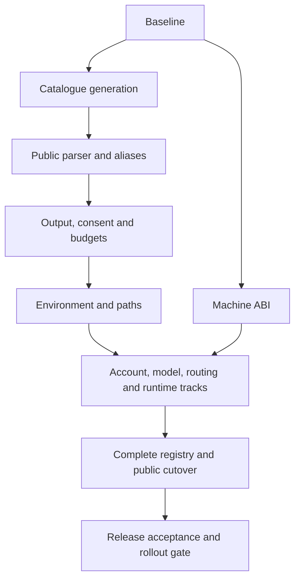

# CQ CLI v2 Implementation Plan

> **For agentic workers:** REQUIRED SUB-SKILL: Use superpowers:subagent-driven-development (recommended) or superpowers:executing-plans to implement this plan task-by-task. Steps use checkbox (`- [ ]`) syntax for tracking.

**Goal:** Implement every command, group, option, output and compatibility rule in the canonical CLI v2 specification, including explicit unavailable behaviour for the four reserved candidate capabilities.

**Architecture:** Introduce one catalogue-driven public parser and renderer, backed by narrow adapters around existing account, quota, routing, service and lifecycle engines. Preserve machine ABIs behind a separate classifier, prepare and test public adapters without exposing a partial command tree, then replace the public entry point in one integration task. Keep existing algorithms and authority boundaries unless the specification explicitly requires a change.

**Tech Stack:** Go 1.26.1 as required by the reviewed module; standard-library parsing/encoding/context/IO; existing provider, proxy and service packages; Python 3 for the existing build-time specification generator. No additional CLI framework or runtime Python dependency.

**Spec:** [Canonical specification](README.md), [commands.json](commands.json), [resource contracts](resources/root.md), [environment](environment.md), [migration](migration.md), [internal ABI](internal-abi.md), [acceptance catalogue](acceptance.md).

## Global Constraints

- “Every intermediate group prints help on bare invocation, exits 0 and reads no state.” Bare `cq` remains `cq check` for `claude`, `codex`, `gemini`.
- “No mutation silently chooses Codex because the user happens to use Codex most often.”
- “Where `--timeout` exists it bounds elapsed operational work: local preparation, locks, requests, verification and cleanup. Time spent waiting for an interactive confirmation is excluded.”
- “They never grant consent.” This applies to JSON and non-terminal stdin; preserve `--yes` and distinct semantic confirmation flags.
- “Aliases preserve operation intent and parameter values, **not** old JSON shapes, ignored options, output-scope changes or old exit-code bugs.”
- “Remove aliases no earlier than 2.0.0.” Target this contract at CQ 1.0.0, CLI/envelope schema 2.
- JSON envelope: `schema_version`, `command`, `ok`, `data`, `errors`, `warnings`; normal output is one document plus LF. Preserve explicit help, completion, hook and JSONL exceptions.
- Exit set: `0, 1, 2, 3, 4, 5, 6, 7, 8, 130`, with exact meanings/messages from the specification.
- Protect only the current Codex system account with reserve. Never consume a reset credit automatically. Preserve continuity, external credential ownership and persistent consumption idempotency.
- Preserve all frozen v1 algorithms, signed formats and machine ABIs except explicitly listed specification deltas. Do not build a release-proof backend in this migration.
- Every Go test invocation uses `-race`. Required integration gates: `go build ./...`, `go vet ./...`, `go test -race -count=1 ./...`.
- Preserve existing dirty work. No live credential mutation, service rollout, push, merge, tag, publication or GitHub status write is authorised by this planning request.

---

## Baseline and delivery decisions

Reviewed checkout `dc976e6591d2b729185a80b974f55300dea255c2` predates released v0.32.5 at `debcb2cb19b61fd0cb2983554299d0edaaa052c5`. Local `main` currently points to the older checkout. The specification includes released reserve, leases, trace, services and installer features absent there. Implementation therefore starts from the exact released commit in an isolated worktree, carrying only this specification package. Do not restore released files over the current checkout or automatically carry its ten modified source/test files. T00 compares those edits and records any still-required regression cases; an actual newer upstream integration base may replace the release baseline only after a fresh inventory diff accounts for every added or changed command.

The 29 tasks below are review units, not one long unreviewable change. Shared framework commits come first. Family adapters then proceed independently where file ownership permits. Keep the old public entry point until T27; test the new path through `runCLIV2`. Do not ship temporary v2 switches, guessed fallback handlers or a half-populated public registry. Before merging into a moving upstream, rebase and re-run affected coverage; no plan instruction authorises a remote write.

### Workstreams and dependencies

| Track | Tasks | Entry dependency | Deliverable |
| --- | --- | --- | --- |
| [Foundation](plan/01-foundation.md) | T00–T06 | None | Baseline, frozen ABI, catalogue, parser, common IO/deadlines, paths, quota reporting |
| [Accounts and models](plan/02-accounts-models.md) | T07–T12 | T02–T05 | Account/reset/model/auth adapters and truthful partial outcomes |
| [Codex routing](plan/03-routing.md) | T13–T16 | T02–T05, T07 | Provider-specific routing, reserve, policy, traces |
| [Runtime and services](plan/04-runtime-services.md) | T17–T23 | T01–T05 | Shared proxy, component lifecycle on three OSes, candidate state and endpoint migration |
| [Validation and rescue](plan/05-validation-rescue.md) | T24–T26 | T01–T05; T17/T18 for active checks | Fixture/readiness/transport, canary/hook, rescue/operation adapters |
| [Cutover and delivery](plan/06-cutover-delivery.md) | T27–T28 | Every adapter and native platform gate | Public cutover, migrated consumers, release evidence and reviewable rollout |



T18 owns service semantics; T19/T20/T21 implement macOS/Linux/Windows adapters against that interface. Native service tasks may run independently in separate worktrees. T22 owns all candidate paths, including four explicit exit-4 handlers. T03 owns all 92 legacy entries; family tasks supply semantic regression fixtures, not separate alias parsers.

### File ownership and scope

- T02–T04 own new `internal/cli/` and catalogue generation. Its code performs no provider discovery, filesystem root creation or service work.
- T05 owns `internal/userdirs/` and shared client model-cache path resolution; model/service tasks consume those functions instead of introducing alternative resolvers.
- Each command family gets a focused `cmd/cq/cli_v2_<family>.go` adapter and matching test file. Existing domain packages retain business logic and authority.
- `cmd/cq/main.go`, old CLI structs/manual help, registry assembly, `go.mod` and `go.sum` are modified by T27 only, except baseline test repair that is explicitly documented in T00. Earlier tasks may add typed engine APIs with wrappers preserving old callers until cutover.
- Do not change routing/account/quota algorithms to make new output tests pass. Adapt data projection and expose actual outcome evidence. Changes to model merge/path semantics are explicitly required by the resource specification.
- Preserve `.go.txt` annexes as documentation. Never copy them into a buildable package or use them as production implementations.

## Shared interfaces fixed before parallel work

T02–T04 define the following small boundary in `internal/cli/types.go`. `Diagnostic`, `Invocation`, `Outcome`, `Session`, `Handler` and `Lookup` are new plan-defined types, not claims that these APIs already exist.

```go
package cli

import (
    "context"
    "encoding/json"
    "io"
)

type Diagnostic struct {
    Code string `json:"code"`
    Message string `json:"message"`
}

type Invocation struct {
    Path string
    Arguments map[string][]string
    Options map[string][]string
    Supplied map[string]bool
    JSON bool
    Presentation string // "run", "help", or "version"
    Warnings []Diagnostic
    LegacySelector string // empty, or "claude_uuid" for the explicit old pin alias
}

type Outcome struct {
    ExitCode int
    Data json.RawMessage
    Errors []Diagnostic
    Warnings []Diagnostic
    Human string
    Streamed bool // terminal write or failed stream write consumed stdout ownership; no retry
}

type Session struct {
    In io.Reader
    Out io.Writer
    Err io.Writer
    Interactive bool
    BuildInfo BuildInfo
}

type Handler func(context.Context, Invocation, *Session) Outcome
type Lookup func(string) (Handler, bool)
```

Required functions and owners:

| Function | Owner | Contract |
| --- | --- | --- |
| `Parse(argv []string) (Invocation, *ParseError)` | T03 | Pure lexical/type/combination validation plus alias normalisation; no environment or IO |
| `Help(path string) (string, bool)` | T02 | Exact generated help; empty path selects root |
| `Run(ctx context.Context, argv []string, session *Session, lookup Lookup) int` | T04 | Parse, resolve pure presentation, look up handler, encode outcome, return exit; no `os.Exit` |
| `WriteJSON(w io.Writer, path string, outcome Outcome) error` | T04 | One exact envelope/LF; also used for individual JSONL records |
| `EncodeData(value any) (json.RawMessage, error)` | T04 | Marshal a declared typed resource DTO; errors propagated, never ignored |
| `BeginBudget(parent context.Context, total time.Duration, cleanupReserve time.Duration) *Budget` | T04 | One monotonic total budget with `Work() context.Context`, `Cleanup() context.Context`, `Pause()`, `Resume()`, `Close()` methods; consent suspension only |
| `Confirm(session *Session, prompt string) (bool, error)` | T04 | Write exact prompt to stderr; consume one response; caller enforces flags/TTY and pauses budget; never treat EOF as yes |
| `HumanValue(value any) string` | T04 | Format one scalar or nullable scalar pointer for interpolation; em dash nulls, locale-independent decimals, lowercase booleans, Unicode Cc escaping |
| `runCLIV2(ctx context.Context, argv []string, session *cli.Session) int` | T27 assembly, earlier tests | Call `cli.Run` with the complete family registry |
| `dispatchMachineABI(argv []string) (handled bool, exitCode int)` | T01 | Match only frozen exact machine forms, before public parsing; use unchanged internal handlers |

`ParseError` is defined by T03 as `{Path string; ExitCode int; Diagnostic Diagnostic}` with `Error() string` returning `Diagnostic.Message`. Syntax failures use exit 2. The syntactically valid retired `operation recover` route returns its specified exit-4 `operation_recovery_unavailable` through `ParseError`; help bypasses its required ID but retains the retirement result. `Run` preserves `ParseError.ExitCode`. Budget context creation begins operational time before local preparation; Pause cancels suspended work only after outstanding work has quiesced, records remaining monotonic duration, and Resume derives fresh contexts from that remaining duration and the original parent's deadline. Pausing cannot extend a parent deadline. At creation and each Resume, effective total is the smaller of command remainder and original parent deadline remainder. Work receives max(0, effective total minus cleanup reserve); Cleanup receives effective total. Thus a 10-second parent remainder with a 5-second reserve allows 5 seconds of work and 10 seconds through cleanup; an already expired parent expires both contexts immediately. Handler code obtains `Work()`/`Cleanup()` after each resume rather than holding a stale context. No concurrent work or pause occurs while a terminal prompt is open. Use an injected clock/timer implementation in budget tests; do not rely on wall-clock sleeps.

Parameter names in Arguments/Options are exactly the catalogue `name`. Values retain argv order, with validated defaults materialised as strings only for literal non-null defaults. Booleans become `true`/`false`; omission-resolved path/port/account values stay absent until the owning handler resolves them. `Supplied` distinguishes user input from defaults, including explicit false. Required semantic confirmation booleans are parsed and default to false; handlers enforce consent with exit 6. Required non-boolean options remain syntax requirements. `ParameterSpec.Metavar` is generated from the catalogue for exact missing-value diagnostics. `Help` also recognises the compatibility-only `proxy pin` guidance without adding a catalogue/completion node. An unavailable candidate capability bypasses all operational dependencies after syntax validation. Help/group/version/completion resolution occurs before lookup, even with an empty handler registry. Session.BuildInfo supplies version provenance to VersionOutcome; a zero value renders dev/null provenance. Nested version presentation always uses command="version" in its envelope, even though Parse retains the requested path. Session input/output streams are supplied by the caller; Run never falls back to process-global streams.

Each task's adapter exports one package-local handler with the common signature, named in its task. A family switch accepts only its assigned canonical paths. Unknown internal registration is an implementation defect, never a provider fallback. Typed DTOs are named after the exact resource contracts and live beside their owning adapters unless shared by two concrete consumers. Do not parse English help/constraint prose at runtime and do not capture old stdout to synthesise JSON.

Outcome.Human is already rendered template text. Adapters call HumanValue for dynamic scalars before interpolation, retain literal template line breaks, and loop over resource arrays in their declared order. Run must not escape the whole rendered template. Nonstream handlers return only their operational warnings; Run prepends Invocation.Warnings and emits the exact stderr warning lines. Stream handlers use WriteJSON for each event, include Invocation.Warnings in their records, apply final interruption/output-failure precedence before their terminal record, and set Streamed after that terminal write or after any failed stream write. A successful interim event alone never sets Streamed. Failed interim and terminal writes both return Streamed=true and exit 1 so Run cannot retry stdout; in this failure case Streamed is not proof that a complete terminal record exists. Run still emits stderr warnings and human diagnostics but never another stdout record when Streamed is true. A normal interrupted Outcome retains its valid Data, including a known operation receipt, and exits 130. Family handlers own their command-specific timeout/partial-result errors and bounded cleanup. Hook stop without --json encodes Outcome.Data directly as its raw JSON object; it does not interpolate the human template into JSON.

Confirm writes the supplied prompt byte-for-byte without adding whitespace or a newline. It reads one LF-terminated line without consuming a later response, trims surrounding whitespace (including CR from CRLF), and accepts only y/yes case-insensitively. EOF before line termination returns false, including an unterminated affirmative word. Handlers enforce JSON/noninteractive requirements before calling Confirm, escape dynamic prompt values, and pause only quiescent operational work. Confirm itself does not manufacture consent flags or alter the operation budget.

## Test harness contract

T04 creates `cmd/cq/cli_v2_contract_test.go`. The following is the exact test-case shape used in task examples:

```go
package main

import "testing"

type v2Case struct {
    Name string
    Scenario string
    Args []string
    Exit int
    Code string
    Command string
    WantJSON string
    Forbid []string
    Calls map[string]int
}

func TestCLIV2RejectsMutationTail(t *testing.T) {
    runV2Case(t, v2Case{
        Name: "remove rejects unknown tail before access",
        Scenario: "no-access",
        Args: []string{"codex", "account", "remove", "alice@example.com", "--dry-run", "--json"},
        Exit: 2,
        Code: "unknown_option",
        Command: "codex account remove",
        Forbid: []string{"credentials", "network", "filesystem-write", "service", "consume"},
    })
}
```

`runV2Case(t *testing.T, c v2Case)` is a planned helper. It builds the named deterministic fixture, invokes `cli.Run` with real family adapters, captures stdout/stderr and boundary calls, asserts exact exit and canonical path, validates the envelope, and compares nonempty `WantJSON` as a recursive JSON subset of `data`. An empty `WantJSON` omits that subset assertion; the complete envelope remains mandatory. Literal `null` requires null data. Empty `Code` means no errors; a nonempty code must appear in errors. `Calls` contains exact invocation counts; `Forbid` requires zero matching calls. The helper must fail on an unknown fixture, forbidden call, extra stdout document or stderr containing fixture secrets. Fixture descriptions in tasks define inputs and failures; they must wire existing injected domain engines, not return precomputed CLI outcomes. `no-access` installs dependencies that panic if reached. Command-family fixture constructors and their registration live in that family's test file. No test executes the user's credential store or installed daemon.

Family test files call `registerV2Fixture(name, constructor)` during init. A `v2FixtureConstructor` takes `*testing.T` and returns `*v2Fixture` with `Lookup`, optional `In`/`Interactive`, and `Secrets`. Constructors install real injected family adapters and call `fixture.Call(boundary)` at their dependency boundaries; the counter is safe for engine goroutines. Registration rejects duplicates/nil constructors; unknown scenarios fail rather than skip. The no-access fixture panics at handler lookup and stdin, preventing construction or execution of any operational dependency. The helper validates six exact envelope keys, explicit diagnostic arrays, canonical command, exit/ok consistency, exactly one document plus LF, recursive object subsets, ordered exact-length arrays, and absence of raw or JSON-escaped secret sentinels. Family stream-specific tests assert their JSONL sequence separately; runV2Case is the single-result contract helper.

Test names and command cases in tasks are concrete minimum regressions. Also import that task's complete per-command acceptance cases from `acceptance.md`, option constraints and resource algorithms; the snippets do not replace coverage of the remaining flags. A failing test means an assertion against valid behaviour, not a compile failure used as evidence. Add declarations first, then demonstrate the failing behavioural assertion.

## Review, commits and completion

Every task follows: add failing behaviour test; run its named focused race test; implement the specified adapter/algorithm; re-run focused tests plus package vet; review diff against its command ownership; commit only task files. Each task supplies a Conventional Commit subject under 50 characters in past tense. Commit body uses concise unordered bullets describing significant changes. Preserve exact commands/identifiers and British English prose. No task authorises a push or merge.

`plan/coverage.json` assigns all 89 leaf commands exactly once, all 37 groups to T02, and every legacy entry to T03 with semantic-owner references. Check it with `python3 specs/cli-v2/plan/check.py`. Final local completion requires all T00–T27 checkboxes plus each supported command's acceptance tests. T28 separates a reviewable release candidate from separately authorised remote/live rollout. Lack of release authority does not block completing the implementation or packaging its evidence, but it prevents claiming deployed acceptance.

Four reserved candidate exit-4 implementations count as complete only when both canonical and legacy spellings reject without IO. Actual proof-backend work remains outside this plan; do not add a fake success path or silently expand scope.

## Plan verification

Reviewed on 10 September 2026. Ownership coverage accounts for 29 tasks, all 89 leaf commands, 37 groups, 203 local option declarations, 19 positional parameters, three global options and 92 legacy entries. The checker verifies dependency acyclicity, exact catalogue/migration ownership, command tables, document links and required plan headers. It does not prove future CLI behaviour.

The existing specification check still validates 126 command/group entries, 154 examples and 127 exact help pages. All ten pre-existing dirty source/test hashes match the captured baseline. This planning work adds documentation and its ownership checker; CLI code, credentials, installed services and release state have not been changed.
